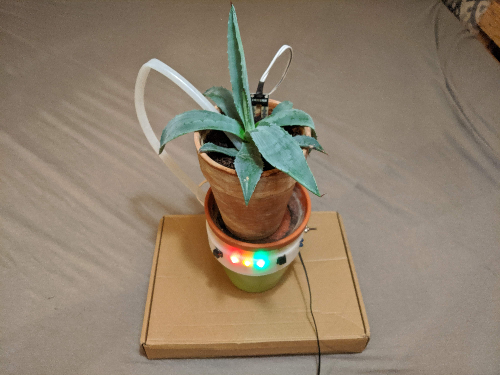

# Easy Grow Dokumentation

Easy Grow ist ein automatisches Bewässerungssystem für Pflanzen. Das System bietet drei verschiedene Einstellungsmöglichkeiten der Erdfeuchtigkeit. Diese Einstellungen können direkt über das System oder über ein Heimnetzwerk mittels einer Web-Applikation vorgenommen werden.
Das Bewässerungssystem hält die Erdfeuchtigkeit über den ganzen Tag feucht und ermöglicht die Langlebigkeit der Pflanzen.



## Features
- Gießen der Pflanze (Automatisiert und Manuell)
- Einstellen der gewünschten Feuchtigkeit

   

- Verbinden zum heimischen WLAN oder Steuerung über eigenes WiFi-Netzwerk


- Darstellung einer Übersichtswebseite mit gewünschter und derzeitiger Feuchtigkeit


## Externe Komponenten
Dieses Projekt nutzt Teile des DNS Servers aus der freien Quelle ```libesphttpd```.
In der Datei ```easy_dns.c``` ist die Lizenz und der Author vermerkt, weitere Informationen sowie das Original finden sich unter  https://github.com/Spritetm/libesphttpd/blob/master/util/captdns.c.

## Inhaltsverzeichnis

- [1. Stromversorgung](#stromversorgung)
    * [1.1 Stromverbrauch](#stromvebrauch)
    * [1.2 Batteriebetrieb](#batteriebetrieb)
- [2. File includes mit make](#make)
    * [2.1 Flash-Argumente](#flash_argumente)
    * [2.2 Erstellen der Dokumentation mit make](#make_documentation)
- [3. Systembausteine](#systembausteine)
    * [3.1 Easy_DNS](#dns)
- [4. ESP8266 Mikrocontroller](#esp8266)
    * [4.1 NodeMCU Plattform](#nodemcu)
    * [4.2 Digitale I/O](#digital_io)
        + [4.2.1 Spannungs- und Strombegrenzungen](#restrictions)
        + [4.2.2 Verwendbare Pins](#usable_pins)
        + [4.2.3 Boot-Modi](#boot_modes)
        + [4.2.4 Interne Pull-Up/-Down-Widerstände](#pull_up_down)
    * [4.3 Pulsweitenmodulation](#pwm)
    * [4.4 Analogeingang](#analog_input)
    * [4.5 Kommunikation](#communication)
        + [4.5.1 Serial](#serial)
        + [4.5.2 I2C](#i2c)
        + [4.5.1 SPI](#spi)
    * [4.6 NodeMCU GPIO-Mapping auf ESP8266](#gpio_mapping_esp)
- [5. Aufsetzen der Softwareumgebung](#sw_env) 
    * [5.1 ESP8266 Toolchain-Setup mit Docker](#tool_docker)
        + [5.1.1 Installierung von Docker](#inst_docker)
            - [5.1.1.1 MacOS](#inst_docker_mac)
            - [5.1.1.2 Windows](#inst_docker_win)
        + [5.1.2 Bauen des Docker-Images](#build_docker)
        + [5.1.3 Freigeben des seriellen Ports vom Hosts zum Docker-Container](#serial_port)
            - [5.1.3.1 MacOS](#serial_port_mac)
            - [5.1.3.2 Windows](#serial_port_windows)
        + [5.1.4 Ausführen des Docker-Containers](#cont_docker)
            - [5.1.4.1 MacOS](#cont_docker_mac)
            - [5.1.4.2 Windows](#cont_docker_win)
    * [5.2 ESP8266 Toolchain-Setup auf einer lokalen Maschine (Nur MacOS)](#local)
- [6. Konfiguration des Espressif IoT Development Frameworks](#idf_config)
    * [6.1 Eclipse IDE](#eclipse)
    * [6.2 ESP IDF](#esp_idf)
- [7. Bauen, Flashen und Monitoring](#build)
- [8. Bauen und Flashen des LED-Beispiels](#led_example)
- [9. ESP8266 RTOS SDK](#rtos_sdk)
    * [9.1 Überblick](#rtos_overview)
    * [9.2 Konzepte](#rtos_concept)
    * [9.3 xTasks](#rtos_xtasks)
    * [9.4 GPIO](#rtos_gpio)
    * [9.5 WiFi](#rtos_wifi)
    * [9.6 HTTP Server](#rtos_http_server)
    * [9.7 Schreiben und Lesen des Flash-Speichers](#rtos_flash)
- [10. Easy Grow Projekt](#easy_grow)
    * [10.1 Hardware-Komponenten](#eg_hardware)
    * [10.2 GPIO-Mapping](#eg_gpio)
    * [10.3 Schaltbild](#eg_circuit)
    * [10.4 Funktionsweise](#eg_functionality)
- [11. Changelog](#changelog)
<!-- toc -->

<a name="stromversorgung"></a>
## 1. Stromversorgung

Die Platine wird über einen Micro USB-B Anschluss mit Strom versorgt. Dabei sind der Pin 1 (VBUS) und der Pin 5 (GND) über einen Kippschalter mit dem Mikrocontroller verbunden. Pin 2,3,4 als Datenleitungen wurden nicht verwendet, da die RX und TX Pins des NodeMCU Boards für das Interface genutzt werden.
Zum Flashen ist daher der Mikrocontroller abnehmbar.

Neben der kompletten Abschaltung des Systems über den Kippschalter, wird diese Schaltung ebenfalls für den Pumpenbetrieb benötigt.
Mit einem Verbrauch von bis zu 8 Watt könnte der Power Regulator des NodeMCU je nach Betriebsart überlastet werden und sich zu hoch erhitzen.

Mit der Betriebsart über den Vin-Pin (Vin-PIn, Micro-USB-Anschluss, sowie 3.3V-Pin werden unterstützt) lassen sich nur um die 800 mA aus der V-Pins beziehen. Daher wird die Pumpe über die von uns entwickelte Platine mit Strom versorgt. 
Zur Ein- und Abschaltung wird ein Mosfet IRLZ44N genutzt.  Die 3.3 V der GPIO-Pins reichen hierbei zum Durchschalten des Mosfets aus. Der direkte Betrieb über die GPIO-Pins ist nicht möglich, da Verbraucher maximal 20mA über diese beziehen dürfen. Zudem wäre die Pumpleistung bei 3.3 V zu schwach. 

<a name="stromvebrauch"></a>
### 1.1 Stromverbrauch

Der Stromverbrauch des Mikrocontrollers schwankt stark in Abhängigkeit zu dem Betriebsmodus. Funktioniert er als Accesspoint, während keine LED leuchtet, liegt der Verbrauch bei 108mA. Ist er mit einem WLAN Netzwerkverbunden benötigt die Schaltung 87 mA.
Pro eingeschaltete LED kommen 13 mA (rote LED,mit 2 V Flussspannung und 100 Ohm Vorwiderstand) hinzu. Die Pumpe verbraucht im Schnitt 1.2 A.

<a name="batteriebetrieb"></a>
### 1.2 Batteriebetrieb

Für Evaluation des Batteriebetriebs muss zunächst der Verbrauch in Amperestunden ermittelt werden. Als typisches Beispiel wird daher angenommen, dass:
1. Der Controller mit einem WLAN verbunden ist (87 mA)
2. Neben den zwei Tank-LEDs eine weitere LED eingeschaltet ist (39 mA)
3. Die Pumpe 20 Sekunden pro Tag pumpt (0.012 mA)

Ein 5V Akku mit 2000 mAh wäre schon nach 15 Stunden leer.

Folgende Möglichkeiten könnte für den Batteriebetrieb in den Betracht gezogen werden:

+ Deaktivieren der LEDs nach wenigen Sekunden und Aktivierung erst wieder bei Knopfdruck
+ Deaktivieren der WiFi-Schnittstelle, wenn in einem gewissen Zeitraum keine SSID/Passworteingabe erfolgt ist.
+ Kompletter Headless-Modus (Keine Web- oder LED-Interface) nach einmaliger Feuchtigkeitseingabe über das Webinterface


<a name="make"></a>
## 2. File includes mit make

Das vordefinierte Makefile des SDKs bietet verschiedene Möglichkeiten Dateien einzubinden. Dafür benötigt jedes Projekt ein eigenes Makefile, das auf das SDK-Makefile verweist:
```
PROJECT_NAME := easy_grow

include $(IDF_PATH)/make/project.mk
```
In diesem können weitere Include-Pfade spezifiziert werden, dies funktioniert in Abhängigkeit der Commit-Version sowie des Pfades dennoch nicht zuverlässig. 
```COMPONENT_ADD_INCLUDEDIRS```
```COMPONENT_SRCDIRS```

Daher wurden in dem Projekt EasyGrow Pseudo-Makefiles in die relevanten Ordner eingefügt. Diese leeren ```component.mk``` Dateien werden im Buildprozess erkannt und Dateien auf gleiche Dateiebene hinzugefügt.

<a name="flash_argumente"></a>
### 2.1 Flash-Argumente

```make build``` ruft den Buildprozess auf und die erzeugte Firmware kann mit  ```make flash``` auf den Mikrocontroller übertragen werden. 
```make flash``` nutzt hierbei die Einstellungen aus der sdkconfig. Diese Datei kann manuell erzeugt oder mit ```make menuconfig``` generiert werden. In ihr sind Daten wie die Baudrate und der USB-Port enthalten. 
Diese Einstellungen können mit ```make print_flash_cmd``` ausgegeben werden und bei direktem flashen über das Phyton-Programm ```esptool.py``` direkt gesetzt werden:

```python esptool.py --chip esp8266 --port /dev/ttyUSB0 --baud 921600 --before default_reset --after hard_reset write_flash -z --flash_mode qio --flash_freq 40m --flash_size detect 0 bootloader/bootloader.bin 0x10000 example_app.bin 0x8000 partitions_singleapp.bin```

Der Aufruf über das ```esptool``` erfolgt innerhalb des Makefiles und bildet somit keinen differenten Flash-Prozess ab.

<a name="make_documentation"></a>
### 2.2 Erstellen der Dokumentation mit make

```make documentation``` bietet die Möglichkeit die aktuelle Dokumentation aus der Datei ```readme.md``` in ein HTML-File umzuwandeln und diese im Anschluss auf einer Webseite des ESP anzuzeigen. Für die Erstellung des HTMLs wird [Pandoc](https://pandoc.org/) benötigt. Der Benutzer kann sich somit die aktuelle Dokumentation des Projekts in dem produktiven System anzeigen lassen. Jedoch werden Bilder dabei nicht abgebildet.


<a name="systembausteine"></a>
## 3. Systembausteine

<a name="dns"></a>
### 3.1 Easy_DNS

Der DNS Server wird genutzt um automatisiert die Setupwebseite anzuzeigen. 
Zunächst wird ein FreeRTOS Task erstellt, dieser läuft bis zur Auswahl eines Wlan Netzwerkes und dem anschließenden Wechsel von AP Mode zu Station Mode. Befindet sich der ESP in einem anderen Netzwerk wird der DNS Server nicht genutzt und kann daher beendet werden.
Bei der Erstellung des DNS Task wird der Namensserver für den UDP Port 53 registriert und die AF_INET Adressen Familien genutzt.
So kann ein Hostname oder eine IPv4 Adresse einem Port, hier alle eigehenden IP-Adressen dem DNS Port, zugewiesen werden. 
Ist der Task gestartet und die Socketverbindung erstellt, werden alle DNS Nachrichten empfangen. Diese müssen im nächsten Schritt gefiltert werden. Dabei werden zu lange (über 512 Bytes), zu kurze (unter 12 Bytes) Nachrichten und DNS Antworten der Klienten ignoriert. 
DNS Antworten werden nicht verarbeitet, weil diese für das Anzeigen einer Netzwerkanmeldung nicht benötigt werden. Ist die DNS Nachricht ein Request wird eine Antwort mit der Weiterleitung an die Netzwerkadresse des ESPs generiert. Das Anzeigen der Netzwerkanmeldung funktioniert je nach Betriebssystem unterschiedlich. Dabei besteht die Gemeinsamkeit im Erkennen der Weiterleitung durch den DNS Server. Das Endgerät versucht eine Webseite aufzurufen (Android z.B. ```connectivitycheck.android.com```) und erhält als Antwort HTTP Status 302 (temporary redirect) anstatt HTTP 204. HTTP 204 würde bedeuten die Seite ist verfügbar aber leer, wodurch das Endgerät weiß, dass eine Internetverbindung besteht. Mit HTTP Status 302, den das Gerät durch unsere DNS Server Weiterleitung erhält, wird die Aufforderung zur Netzwerkanmeldung angezeigt.

<a name="esp8266"></a>
## 4. ESP8266 Mikrocontroller

Der ESP8266 ist ein System on a Chip (SoC), hergestellt von der chinesischen Firma Espressif. 
Es besteht aus einer Tensilica L106 32-Bit Mikrocontroller-Einheit (MCU) und einem Wi-Fi-Transceiver. Es verfügt über 11 GPIO-Pins (General Purpose Input/Output Pins) und einen Analogeingang. Es kann wie jeder andere Mikrocontroller programmiert werden.

Die Wi-Fi-Kommunikation kann genutzt werden, um sich mit einem Heimnetzwerk zu verbinden, einen Webserver mit echten Webseiten zu hosten und Smartphones mit ihm verbinden zu lassen.

<a name="nodemcu"></a>
### 4.1 NodeMCU Plattform

ESP8266 ist nur der Name des Chips, viele Unternehmen haben ihre eigenen Boards entwickelt, die diesen Chip verwenden, so dass es viele verschiedene EESP8266 Boards auf dem Markt gibt. In diesem Projekt wurde die NodeMCU Plattform verwendet und im Weiteren die Eigenschaften und Funktionalitäten näher beschrieben.

Die Features des NodeMCU Development Boards sind folgende:
-	“USB-to-Serial Converter” zur Programmierung
-	3,3 V-Regler für die Stromversorgung
-	On-Board-LEDs zum Debuggen
-	Spannungsteiler zur Skalierung des Analogeingangs
-	Einen Flash-Speicher mit 4 MB Kapazität

| __GPIO__ | __3,3V Vreg__ | __USB-to-Serial__ | __Auto-Reset__ | __Auto-Program__ | __Flash__      | __ADC Range__ |
| :--- |  :---     | :---          | :---       | :---         | :---       | :---      |
| 11   | +         | +             | +          | +            | 4MB (32Mb) | 0-3,3 V   |

Dieses Board wird im Gerätemanager (Windows) oder in ```lsusb``` (Linux) angezeigt, sobald es angeschlossen wird. Es verfügt über einen integrierten 3,3 V-Regler und kann direkt über USB programmiert werden, so dass keine externen Komponenten benötigt werden, um es zu betreiben.

Der ESP8266 sollte mit maximal 3,3 V betrieben werden, da es bei einem 5V-Netzteil zerstört wird. Die I/O-Pins des ESP8266 sind nicht 5 V tolerant und werden ebenfalls bei einer 5 V Spannung zerstört. Der ESP8266 kann zudem nur 12 mA pro Ausgangspin erzeugen oder absenken.

Des Weiteren teilt der ESP8266 die Systemressourcen und die CPU-Zeit zwischen ihren „Sketches“ und dem Wi-Fi-Treiber. Auch Features wie Pulsweitenmodulation (PWM), Interrupts oder I2C werden in der Software emuliert.

<a name="digital_io"></a>
### 4.2 Digitale I/O

Der ESP8266 verfügt über digitale Ein-/Ausgangspins (I/O oder GPIO, General Purpose Input/Output Pins). Sie können als digitale Eingänge zum Lesen einer digitalen Spannung oder als digitale Ausgänge, entweder 0 V (Senkstrom) oder 3,3 V (Quellenstrom), verwendet werden.

<a name="restrictions"></a>
#### 4.2.1 Spannungs- und Strombegrenzungen

Der ESP8266 ist ein 3,3 V Mikrocontrollern, so dass seine GPIOs auch mit 3,3 V arbeiten. Die Pins sind nicht 5 V tolerant, wenn mehr als 3,6 V auf einen Pin angewendet werden, wird der Chip zerstört. Der maximale Strom, der von einem einzelnen GPIO-Pin bezogen werden kann, beträgt 12 mA.

<a name="usable_pins"></a>
#### 4.2.2 Verwendbare Pins

Der ESP8266 hat 17 GPIO-Pins (0-16), von denen jedoch nur 11 verwendet werden können, da 6 Pins (GPIO 6-11) zum Anschluss des Flash-Speicherchips verwendet werden. Dies ist der kleine 8-beinige Chip direkt neben dem ESP8266. Wenn diese Pins verwendet werden, kann dieser Zugriff das Programm zum Absturz bringen.

GPIO 1 und 3 werden als TX und RX der seriellen Hardware-Schnittstelle (UART) verwendet, so dass sie in den meisten Fällen nicht als normale I/O beim Senden/Empfangen serieller Daten verwendet werden können.

<a name="boot_modes"></a>
#### 4.2.3 Boot-Modi

Einige I/O-Pins haben eine spezielle Funktion beim Booten. Sie wählen einen von 3 Boot-Modi:

| __GPIO15__ | __GPIO0__ | __GPIO2__ | __Modus__                      |
| :---   | :---  | :---  | :---                       |
| 0 V    | 0 V   | 3,3 V | UART Bootloader            |
| 0 V    | 3,3 V | 3,3 V | Boot Sketch<br>(SPI Flash) |
| 3,3 V  | X     | X     | SDIO Modus                 |

Diese Bedingungen werden erfüllt, in dem zusätzliche Widerstände durch den Leiterplattenhersteller des NodeMCUs eingebaut wurden. Dies hat jedoch einige Auswirkungen:

- GPIO15 ist immer low gezogen, so dass der interne Pull-Up-Widerstand nicht verwendet werden kann. Dies muss beachtet werden, sobald der GPIO 15 als Eingang verwendet wird um einen Schalter zu lesen oder an ein Gerät mit einen Open-Collector-Ausgang oder einen Open-Drain-Ausgang angeschlossen wird, wie z.B. I2C.
- GPIO0 wird im Normalbetrieb auf high gezogen, so dass es nicht als Hi-Z-Eingang verwendet werden kann.
- GPIO2 kann beim Booten nicht auf low sein, so dass kein Schalter daran angeschlossen werden kann

<a name="pull_up_down"></a>
#### 4.2.4 Interne Pull-Up/-Down-Widerstände

GPIO 0-15 haben alle einen eingebauten Pull-Up-Widerstand. GIPO 16 hat einen eingebauten Pull-Down-Widerstand.

<a name="pwm"></a>
### 4.3 Pulsweitenmodulation

Der ESP8266 unterstützt keine Hardware-PWM, jedoch wird Software-PWM auf allen digitalen Pins unterstützt. Der Standard-PWM-Bereich beträgt 10 Bit bei 1 kHz. Der Bereich kann aber bis zu 14 Bit bei 1 kHz verändert werden.

<a name="analog_input"></a>
### 4.4 Analogeingang

Der ESP8266 verfügt über einen einzigen Analogeingang mit einem Eingangsbereich von 0-1 V. Wenn eine Spannung von 3,3 V geliefert wird, kann der Chip beschädigt werden. Der NodeMCU hat einen integrierten resistiven Spannungsteile, um einen Bereich von 0-3,3 V zu erhalten. Es kann zudem ein Trimpot als Spannungsteiler verwendet werden. Der ADC (Analog-Digital-Wandler) hat eine Auflösung von 10 Bit.

<a name="communication"></a>
### 4.5 Kommunikation

<a name="serial"></a>
#### 4.5.1 Serial

Der ESP8266 verfügt über zwei Hardware-UARTS (Serielle Schnittstellen):

UART0 an den Pins 1 und 3 (TX0 bzw. RX0) und UART1 an den Pins 2 und 8 (TX1 bzw. RX1), jedoch wird GPIO 8 zum Anschluss des Flash-Speicherchips verwendet. Das bedeutet, dass UART1 nur Daten übertragen kann.

UART0 hat auch eine Hardware-Flusskontrolle an den Pins 15 und 13 (RTS0 bzw. CTS0). Diese beiden Pins können auch als alternative TX0- und RX0-Pins verwendet werden.

<a name="i2c"></a>
#### 4.5.2 I2C

Der ESP hat keine Hardware TWI (Two Wire Interface), ist aber in Software implementiert. Das bedeutet, dass so ziemlich alle zwei digitalen Pins verwendet werden können. Standardmäßig verwendet die I2C-Bibliothek Pin 4 als SDA und Pin 5 als SCL. Die maximale Geschwindigkeit beträgt ca. 450 kHz.

<a name="spi"></a>
#### 4.5.1 SPI

Der ESP8266 verfügt über einen SPI-Anschluss, der dem Benutzer zur Verfügung steht, der als HSPI bezeichnet wird. Es verwendet GPIO14 als CLK, 12 als MISO, 13 als MOSI und 15 als Slave Select (SS). Es kann sowohl im Slave- als auch im Master-Modus (in der Software) verwendet werden.

<a name="gpio_mapping_esp"></a>
### 4.6 NodeMCU GPIO-Mapping auf ESP8266

 = Zur Verwendung empfohlen

 = Kann zu unerwartetes Verhalten führen (vor allem beim Booten)

 = Nicht zur Verwendung empfohlen

| __Label__ | __GPIO__ | __Input__          | __Output__                    | __Bemerkung__                                                        |
| :---  | :--- | :---           | :---                      | :---                                                             |
| D0    | 16   | Kein Interrupt | Kein PWM oder I2C Support | HIGH beim Boot.<br>Wird verwendet um vom Deep-Sleep aufzuwecken. |
| D1    | 5    |  |  | Oft als SCL (I2C) verwendet.  |
| D2    | 4    |  |  | Oft als SCL (I2C) verwendet.  |
| D3    | 0    | Pulled UP |  | Verbunden mit dem FLASH-Taster.<br>Boot schlägt fehl wenn auf LOW gezogen. |
| D4    | 2    | Pulled UP |  | HIGH beim Boot.<br>Mit dem On-Board-LED verbunden.<br>Boot schlägt fehl wenn auf LOW gezogen. |
| D5    | 14    |  |  | SPI (SCLK) |
| D6    | 12    |  |  | SPI (MISO) |
| D7    | 13    |  |  | SPI (MOSI) |
| D8    | 15    | Pulled to GND |  | SPI (CS)<br>Boot schlägt fehl wenn auf HIGH gezogen. |
| RX    | 3     |  | <br>RX pin | HIGH beim Boot. |
| TX    | 1     | <br>TX pin |  | HIGH beim Boot.<br>Debug-Ausgabe beim Boot.<br>Boot schlägt fehl wenn auf LOW gezogen. |
| A0    | ADC0     | <br> |  | Analog Input |

<a name="sw_env"></a>
## 5. Aufsetzen der Softwareumgebung

Das Projekt "Easy Grow" wurde mittels des ESP8266 RTOS Software Development Kits (ESP-IDF Style) entwickelt.
In diesem Kapitel wird der Setup der Software-Umgebung beschrieben.
Der Setup bezieht sich auf die Installation der Toolchain, um Applikationen für den ESP8266 Chip zu bauen, sowie die Installation des ESP8266 RTOS SDKs, welche die API für den ESP8266 und Scripte für den Betrieb der Toolchain beinhaltet. Das ESP8266 RTOS SDK basiert auf das Real-Time-Betriebssystem FreeRTOS für Embedded-Devices. Die Grundlagen hierfür werden im Kapitel [9. ESP8266 RTOS SDK](#rtos_sdk) behandelt.

Um Anwendungen für ESP8266 zu entwickeln, wird folgendes benötigt:

- PC, der mit einem Windows-, Linux- oder Mac-Betriebssystem ausgestattet ist.
- Toolchain zur Entwicklung der Anwendung für ESP8266.
- ESP8266 RTOS SDK, das die API für ESP8266 und die Toolchain enthält.
- Das ESP8266-Board (NodeMCU) selbst und ein USB-Kabel zum Anschluss an den PC.


Es stehen zwei Setup-Möglichkeiten zur Verfügung um die ESP8266 Software-Umgebung aufzusetzen:

1. Mittels eines Docker-Images (Linux Ubuntu 16.04 64bit)
2. Installierung auf einer lokalen Maschine mittels eines Scripts (Nur MacOS)

Für die Installation wird Docker empfohlen.

<a name="tool_docker"></a>
### 5.1 ESP8266 Toolchain-Setup mit Docker

<a name="inst_docker"></a>
#### 5.1.1 Installierung von Docker

<a name="inst_docker_mac"></a>
##### 5.1.1.1 MacOs

1. Brew installieren: https://brew.sh
2. Docker Engine und Docker-Machine installieren:<br/>```$ brew install docker```
3. Cask zum Brew Tap hinzufügen:<br/>```$ brew tap caskroom/cask```
3. Docker Client installieren:<br/>```$ brew cask install docker```
4. Optional: Falls Virtualbox nach dem 2. Schritt fehlt. Virtualbox installieren mit:<br/>```$ brew cask install virtualbox```

<a name="inst_docker_win"></a>
##### 5.1.1.2 Windows

Folge den Anweisungen auf https://docs.docker.com/docker-for-windows.

<a name="build_docker"></a>
#### 5.1.2 Bauen des Docker-Images

Das Docker-Image muss nur einmal gebaut werden. Mit ```$ docker images``` kann überprüft werden, ob das Image bereits installiert wurde.

Das Image muss nicht installiert werden, falls die Zeile ```docker-esp8266``` im Terminal ausgegeben wird.

Falls ```docker-esp8266``` im Terminal nicht erscheint, müssen die folgenden Schritte ausgeführt werden:

1. Wechsle das Verzeichnis indem sich die ```Dockerfile``` befindet:<br/>```$ cd <project_path>/docker```
2. Baue das Docker-Image: ```$ docker build -t docker-esp8266 .```

Im 2. Schritt wird ein Ubuntu-Image gebaut und die vorausgesetzten Packages für den ESP8266 Toolchain installiert. Der Befehl führt nach der Ausführung einen Script aus, der die Toolchain installiert.

<a name="serial_port"></a>
#### 5.1.3 Freigeben des seriellen Ports vom Hosts zum Docker-Container

<a name="serial_port_mac"></a>
##### 5.1.3.1 MacOS

Für MacOS muss der "CP210x USB to UART Bridge VCP" Treiber installiert werden.

Lade den Treiber herunter und folge den Anweisungen auf der Silicon Labs Website (https://www.silabs.com/products/development-tools/software/usb-to-uart-bridge-vcp-drivers).

Überprüfe ob der Treiber erfolgreich installiert wurde. Die folgende Zeile ```$ ls /dev/tty.*``` sollte ```/dev/tty.SLAB_USBtoUART``` ausgeben.

Die nächsten Schritte zeigen, wie ein serieller Port vom Host an den Docker-Container freigegeben werden kann.
Hierfür muss zunächst ein Virtualbox Treiber für die Docker-Maschine erzeugt werden.

1. ```$ docker-machine create --driver virtualbox default```
2. Überprüfe ob der Treiber erzeugt wurde: ```$ docker-machine ls```
3. Stoppe die Docker-Maschine: ```$ docker-machine stop```
4. Jetzt kann die VM konfiguriert und der serielle Port exportiert werden. Öffne die Virtualbox Anwendung. Wähle die 'default' VM aus und klicke auf den 'Settings' Button, um die USB Einstellungen vorzunehmen.


5. Klicke auf 'Ports' und anschließend auf den 'USB' Tab. Aktiviere die 'Enable USB Controller' Checkbox. Wähle 'USB 2.0 (EHCI) Controller' aus. Füge einen USB Filter hinzu (USB Icon mit grünem Plus Symbol). Wähle den 'Silicon Labs CP2102 USB to UART Bridge Controller [0100]' Treiber aus.


6. Falls USB 2.0 nicht ausgewählt werden kann, muss der 'Oracle VM VirtualBox Extension Pack' installiert werden. Die Anweisungen für die Installation befindet sich hier: https://www.virtualbox.org/wiki/Downloads
7. Starte die Docker-Maschine mit: ```$ docker-machine start```
8. Es müssen einige Umgebungsvariablen gesetzt werden, damit Docker die VM verwendet anstelle des nativen Modus. Das ```$ docker-machine env``` Kommando gibt die notwendigen Schritte für das Setzen der Variablen an. Führe folgenden Befehl aus um diese zu setzen: ```& eval "$(docker-machine env default)"```

Der serielle Port des Hosts ist nun vom Docker-Container aus ansprechbar.

<a name="serial_port_win"></a>
##### 5.1.3.2 Windows

Leider gibt es bis auf Weiteres keine Unterstützung der 'Device Assignment' und 'Sharing Workloads' in Hyper-V-isolierte Windows Containern. 

<a name="cont_docker"></a>
#### 5.1.4 Ausführen des Docker-Containers

Stelle sicher, dass Docker installiert, das ```docker-esp8266``` Image gebaut und der serielle Port des Hosts an den Docker-Container freigegeben wurde, bevor der Docker container gestartet werden soll.

Es gibt zwei Möglichkeiten einen Container vom ```docker-esp8266``` Image zu instanziieren:

1. Über den ```docker.sh``` Script.<br/>(Nur MacOS)
2. Über den ```docker run``` Befehl.<br/>(Empfohlen für Windows)

<a name="cont_docker_mac"></a>
##### 5.1.4.1 MacOS

1. Wechsle in den ```docker``` Ordner im Projektverzeichnis: ```$ cd <project_path>/docker```
2. Starte den Container mit dem Script: ```$ ./docker.sh```. Dieser Script startet einen Container für das ```docker-esp8266``` Image. Der Script mountet zudem das Projektverzeichnis in das ```/easy-grow``` Verzeichnis des Containers. Zudem exportiert er den Hosts ```/dev/ttyUSB0``` Port an den Port ```/dev/ttyUSB0``` des Containers.

<a name="cont_docker_win"></a>
##### 5.1.4.2 Windows

Führe folgendes Befehl im Projektverzeichnis ```<project_path>``` aus:<br/>
```docker run -ti --rm --name esp8266 -v <project_path>:/easy-grow docker-esp8266 /bin/bash```

<a name="local"></a>
### 5.2 ESP8266 Toolchain-Setup auf einer lokalen Maschine (Nur MacOS)

Wechsle in das ```setup``` Verzeichnis im Projektverzeichnis um die Softwareumgebung für den ESP8266 aufzusetzen.
Dort befindet sich der ```initial_setup.sh``` Script, der folgendes automatisch aufsetzt:

- Die Toolchain um Applikationen für den ESP8266 zu bauen.
- Die ESP8266 RTOS SDK, die die API und Scripte beinhaltet um die Toolchain zu betreiben.

Übergebe das ```--dir <path>``` Argument, um die Softwareumgebung in einem beliebigen Verzeichnis zu installieren. 
Wird dieses Argument nicht gesetzt, wird standardmäßig die Softwareumgebung im ```ESP``` Ordner des Projektverzeichnis installiert.

Die Toolchain befindet sich im Pfad ```<path>/ESP/xtensa-lx106-elf``` wohingegen die SDK sich im Pfad ```<path>/ESP/ESP8266_RTOS_SDK``` befindet.

Öffne ein neues Terminalfenster und füge den folgende Befehl ein um das Setup zu starten:
- Wechsle in das ```setup``` Verzeichnis im Projektpfad:<br>```$ cd setup```
- Führe den Script als ein User aus (nicht als Root):<br>```$ ./initial-setup.sh```
- Warte bis das Setup beendet ist.
- Vergiss nicht dein ```bash_profile``` nach dem Setup zu sourcen:<br> ```$ source ~/.bash_profile```

<a name="idf_config"></a>
## 6. Konfiguration des Espressif IoT Development Frameworks

<a name="eclipse"></a>
### 6.1 Eclipse IDE
TODO @Tim

<a name="esp_idf"></a>
### 6.2 ESP IDF

1. Führe ```$ make menuconfig``` im Projektverzeichnis aus um das Framework zu konfigurieren.
2. Wähle 'Serial flasher config' aus. Ändere den 'Default serial port' zu ```/dev/ttyUSB0```. Das wird nur vorausgesetzt, wenn MacOS or Linux verwendet wird. Unter Windows Hosts wird es nicht benötigt, da es keine Unterstützung für 'Device Assignments' gibt.
3. Wähle 'Flash SPI mode' aus und wähle anschließend 'DIO' aus.
4. Speichere die Einstellungen und verlasse das Konfigurationsmenü.

<a name="build"></a>
## 7. Bauen, Flashen und Monitoring

1. Baue das Projekt mit ```$ make``` aus dem Projektverzeichnis.
2. Führe ```$ make flash``` aus, um den nodeMCU zu flashen. Dieser Schritt funktioniert nur unter MacOS und Linux, jedoch nicht unter Windows Hosts.
3. Verbinde den nodeMCU nach dem Flashen. Um das Monitoring auszuführen führe ```$ make monitor``` aus. Dieser Schritt funktioniert nur unter MacOS und Linux, jedoch nicht unter Windows Hosts.

<a name="led_example"></a>
## 8. Bauen und Flashen des LED-Beispiels

1. Klone das Git Repository:<br>```$ git clone git@gitlab.mi.hdm-stuttgart.de:embedded/ss19/easy-grow.git```
2. Wechsle in das Projektverzeichnis ```easy-grow```:<br>```$ cd easy-grow```
3. Checke den ```example``` Branch aus:<br>```$ git checkout example```
4. Wechsle in das ```docker``` Verzeichnis:<br>```$ cd docker```
5. Verbinde den ESP8266 nodeMCU mittels USB.
6. Führe den ```docker.sh``` Script aus. Dieser Script erzeugt das Docker Image ```docker-esp8266``` und initialisier einen Container mit der ESP IDF Umgebung.<br>```$ ./docker.sh```
7. Wechsle innerhalb des Containers zum ```easy-grow``` Projektverzeichnis:<br>```$ cd easy-grow```
8. Konfiguriere den 'serial flasher' der ESP IDF. Weitere Informationen befinden sich hier: [6. Konfiguration des Espressif IoT Development Frameworks](#idf_config).
9. Baue das Projekt, flashe den nodeMCU, und aktiviere das Monitoring mit:<br>```$ make && make flash && make monitor```.<br> Falls eine Fehlermeldung erscheint, führe den folgenden Befehl erneut aus: ```$ make flash && make monitor```.

<a name="rtos_sdk"></a>
## 9. ESP8266 RTOS SDK

<a name="rtos_overview"></a>
### 9.1 Überblick

<a name="rtos_concepts"></a>
### 9.2 Konzepte

<a name="rtos_xtasks"></a>
### 9.3 xTasks

<a name="rtos_gpio"></a>
### 9.4 GPIO

<a name="rtos_wifi"></a>
### 9.5 WiFi

<a name="rtos_http_server"></a>
### 9.6 HTTP Server

<a name="rtos_flash"></a>
### 9.7 Schreiben und Lesen des Flash-Speichers

<a name="easy_grow"></a>
## 10. Easy Grow Projekt

<a name="eg_hardware"></a>
### 10.1 Hardware-Komponenten

<a name="eg_gpio"></a>
### 10.2 GPIO-Mapping

| __Label__ | __GPIO__ | __Sensor__ | __Input__ | __Output__ | __ISR__ | __Bemerkung__ |
| :--- | :--- | :--- | :--- | :--- | :--- | :--- |
| D0    | 16   | Pumpe | x | ✔ | x | HIGH beim Boot. |
| D1    | 5    | LED Feuchtigkeit 2 (MID) | x | ✔ | x | - |
| D2    | 4    | LED Feuchtigkeit 1 (LOW) | x | ✔ | x | - |
| D3    | 0    | Decrease-Button | ✔ | x | ✔ | Boot schlägt fehl wenn auf LOW gezogen. |
| D4    | 2    | LED Feuchtigkeit 3 (HIGH) | x | ✔ | x | HIGH beim Boot.<br>Boot schlägt fehl wenn auf LOW gezogen. |
| D5    | 14   | Increase-Button | ✔ | x | ✔ | - |
| D6    | 12   | Wasserstandsensor 1 (Oben) | ✔ | x | ✔ | - |
| D7    | 13   | Wasserstandsensor 2 (Unten) | ✔ | x | ✔ | - |
| D8    | 15   | LED Wasserstand 1 (Oben) | x | ✔ | x | Boot schlägt fehl wenn auf HIGH gezogen. |
| RX    | 3    | Photodiode | ✔ | x | ✔ | HIGH beim Boot. |
| TX    | 1    | LED Wasserstand 2 (Unten) | x | ✔ | x | HIGH beim Boot.<br>Boot schlägt fehl wenn auf LOW gezogen. |
| A0    | ADC0 | Feuchtigkeitssensor | ✔ | x | x | Analog Input |

<a name="eg_circuit"></a>
### 10.3 Schaltbild


<a name="eg_functionality"></a>
### 10.4 Funktionsweise

<a name="changelog"></a>
## 11. [Changelog](changelog.md)
