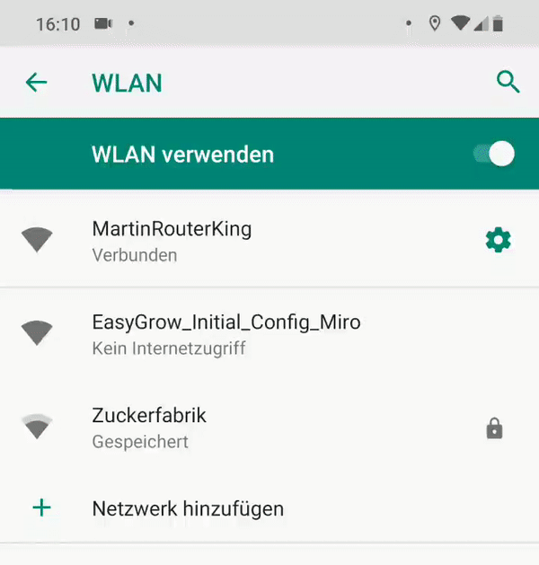
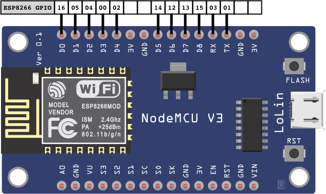
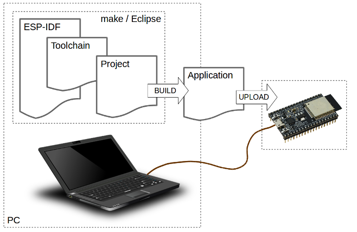
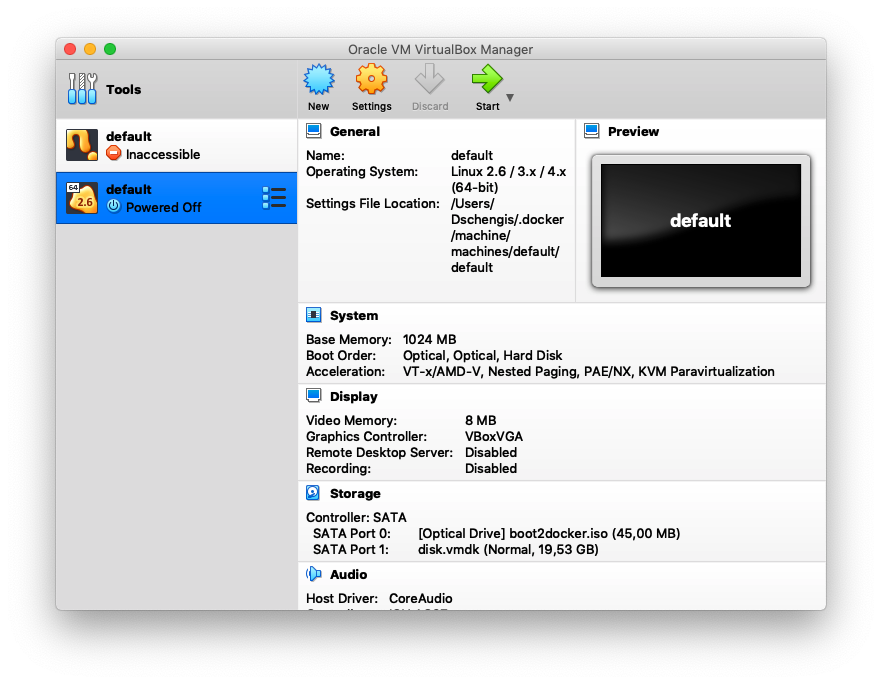
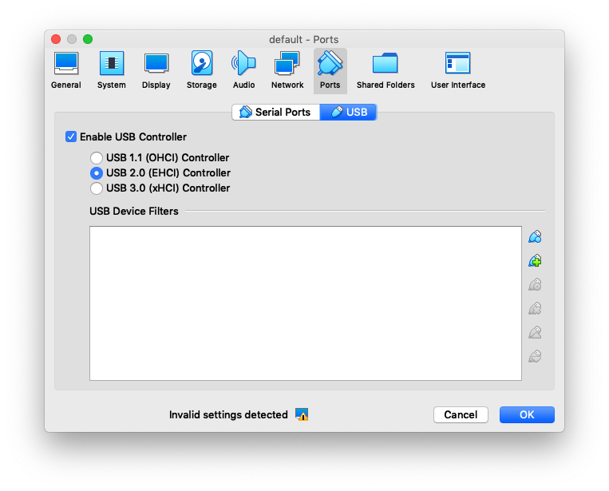
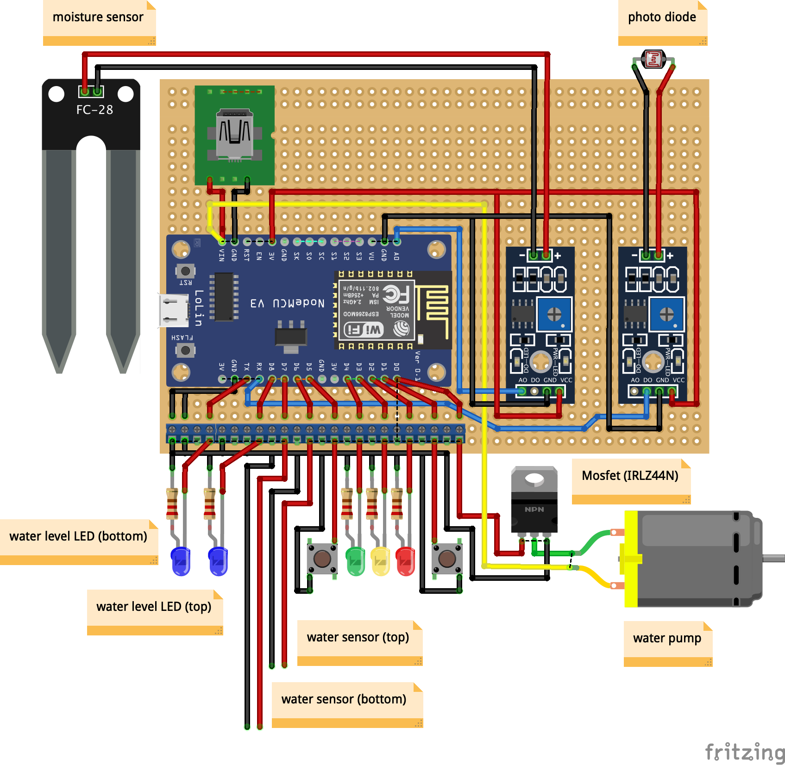
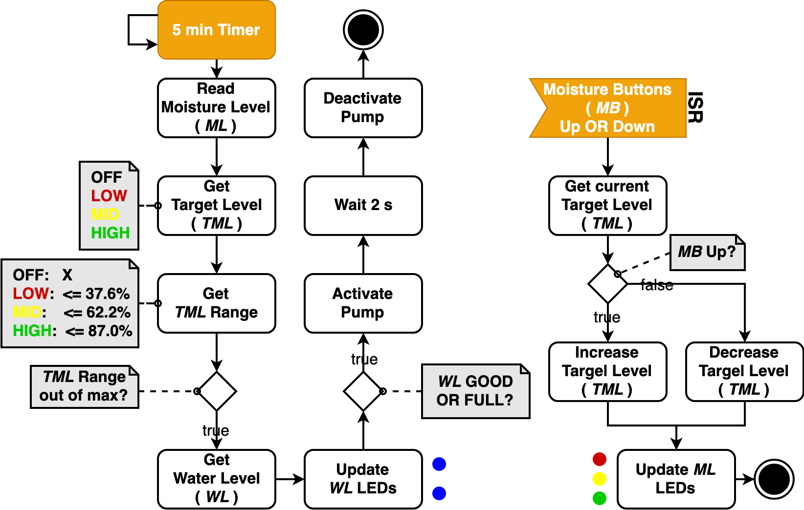
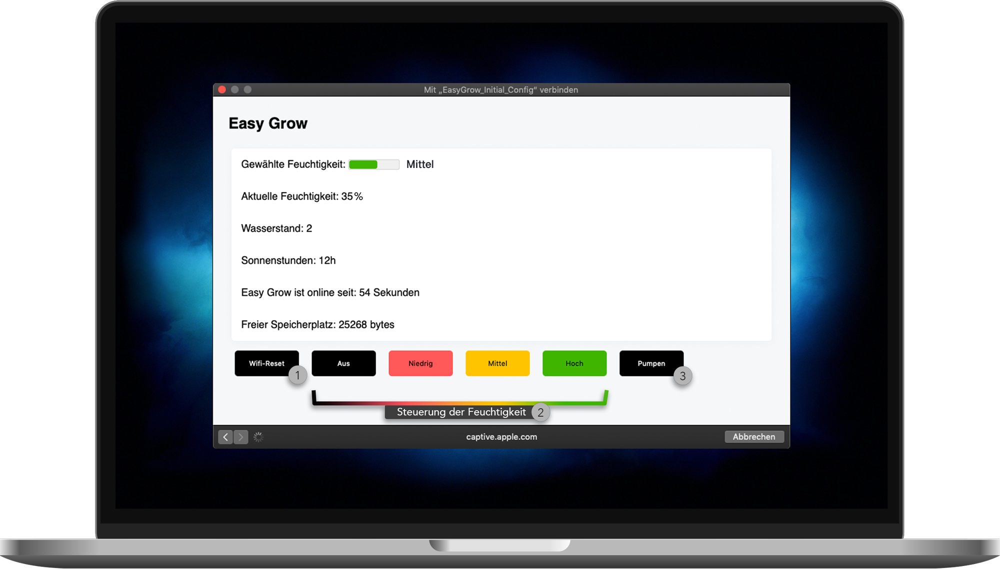
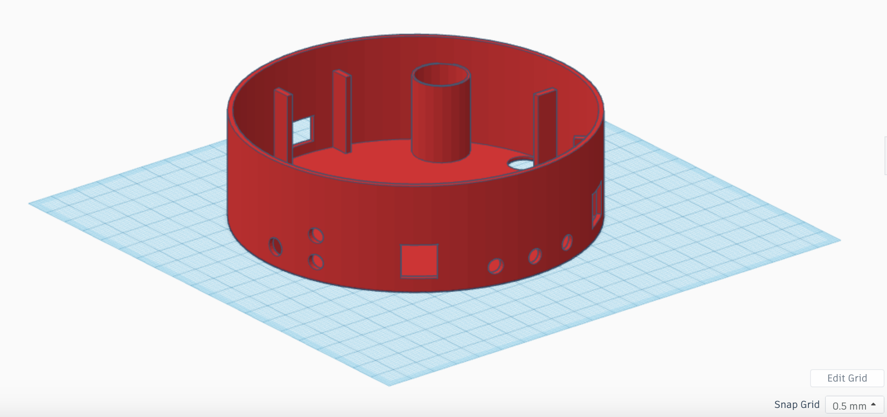

# Easy Grow Dokumentation

Easy Grow ist ein automatisches Bewässerungssystem für Pflanzen. Das System bietet drei verschiedene Einstellungsmöglichkeiten der Erdfeuchtigkeit. Diese Einstellungen können direkt über das System oder über ein Heimnetzwerk mittels einer Web-Applikation vorgenommen werden.
Das Bewässerungssystem hält die Erdfeuchtigkeit über den ganzen Tag feucht und unterstützt somit die Langlebigkeit der Pflanzen.

<div style="width:100%; background:red; margin:0 20px 0 20px; text-align:center;">
</div>
</div>


## Externe Komponenten
Dieses Projekt nutzt Teile des DNS Servers aus der freien Quelle ```libesphttpd```.
In der Datei ```easy_dns.c``` ist die Lizenz und der Author vermerkt, weitere Informationen sowie das Original finden sich unter  https://github.com/Spritetm/libesphttpd/blob/master/util/captdns.c.

## Inhaltsverzeichnis
- [1. Features](#features)
- [2. Erstellen der Dokumentation mit make](#make_documentation)
- [3. ESP8266 Mikrocontroller](#esp8266)
    * [3.1 NodeMCU Plattform](#nodemcu)
    * [3.2 Digitale I/O](#digital_io)
        + [3.2.1 Spannungs- und Strombegrenzungen](#restrictions)
        + [3.2.2 Verwendbare Pins](#usable_pins)
        + [3.2.3 Boot-Modi](#boot_modes)
        + [3.2.4 Interne Pull-Up/-Down-Widerstände](#pull_up_down)
    * [3.3 Pulsweitenmodulation](#pwm)
    * [3.4 Analogeingang](#analog_input)
    * [3.5 Kommunikation](#communication)
        + [3.5.1 Serial](#serial)
        + [3.5.2 I2C](#i2c)
        + [3.5.3 SPI](#spi)
    * [3.6 NodeMCU GPIO-Mapping auf ESP8266](#gpio_mapping_esp)
- [4. Aufsetzen der Softwareumgebung](#sw_env) 
    * [4.1 ESP8266 Toolchain-Setup mit Docker](#tool_docker)
        + [4.1.1 Installierung von Docker](#inst_docker)
            - [4.1.1.1 MacOS](#inst_docker_mac)
            - [4.1.1.2 Windows](#inst_docker_win)
        + [4.1.2 Bauen des Docker-Images](#build_docker)
        + [4.1.3 Freigeben des seriellen Ports vom Hosts zum Docker-Container](#serial_port)
            - [4.1.3.1 MacOS](#serial_port_mac)
            - [4.1.3.2 Windows](#serial_port_windows)
        + [4.1.4 Ausführen des Docker-Containers](#cont_docker)
            - [4.1.4.1 MacOS](#cont_docker_mac)
            - [4.1.4.2 Windows](#cont_docker_win)
    * [4.2 ESP8266 Toolchain-Setup auf einer lokalen Maschine (Nur MacOS)](#local)
- [5. Konfiguration des Espressif IoT Development Frameworks](#idf_config)
    * [5.1 Eclipse IDE](#eclipse)
    * [5.2 ESP IDF](#esp_idf)
- [6. File includes mit make](#make)
    * [6.1 Flash-Argumente](#flash_argumente)
- [7. Bauen, Flashen und Monitoring](#build)
- [8. Bauen und Flashen des LED-Beispiels](#led_example)
- [9. ESP8266 RTOS SDK](#rtos_sdk)
    * [9.1 Überblick](#rtos_overview)
    * [9.2 Konzepte](#rtos_concept)
    * [9.3 xTasks](#rtos_xtasks)
    * [9.4 Beispiel Projekt](#example_project)
    * [9.5 GPIO](#rtos_gpio)
        + [9.5.1 Konfiguration](#rtos_gpio_conf)
        + [9.5.2 Interrupt Service Routine](#rtos_gpio_isr)
        + [9.5.3 Analogeingang](#rtos_gpio_analog)
    * [9.6 Timer](#rtos_timer)
    * [9.7 WiFi](#rtos_wifi)
    * [9.8 HTTP Server](#rtos_http_server)
    * [9.9 Schreiben und Lesen des Flash-Speichers](#rtos_flash)
- [10. Easy Grow Projekt](#easy_grow)
    * [10.1 Hardware-Komponenten](#eg_hardware)
    * [10.2 Stromversorgung](#stromversorgung)
        + [10.2.1 Stromverbrauch](#stromvebrauch)
        + [10.2.2 Batteriebetrieb](#batteriebetrieb)
    * [10.3 GPIO-Mapping](#eg_gpio)
    * [10.4 Schaltbild](#eg_circuit)
    * [10.5 Funktionsweise](#eg_functionality)
        + [10.5.1 Hardware-Logik](#eg_func_hw_logic)
            - [10.5.1.1 Einstellung der Erdfeuchtigkeit](#eg_func_hw_logic_set_moisture)
            - [10.5.1.2 Messung der Erdfeuchtigkeit](#eg_func_hw_logic_read_moisture)
            - [10.5.1.3 Bewässerung der Pflanze](#eg_func_hw_logic_watering)
            - [10.5.1.4 Aufzeichnung der Sonnenstunden](#eg_func_hw_logic_sun_hours)
            - [10.5.1.5 Programmablaufplan](#eg_func_hw_logic_pap)
        + [10.5.2 Webserver](#eg_func_server)
        + [10.5.3 Access-Point](#eg_func_ap)
        + [10.5.4 Easy_DNS](#eg_func_dns)   
        + [10.5.5 Bedienung der Webansichten](#eg_func_server_gui)    
            - [10.5.5.1 Setupwebseite](#eg_func_server_gui-initial)
            - [10.5.5.2 Access-Point Seite](#eg_func_server_gui-ap)
    * [10.6 Git / CICD](#git)
        - [10.6.1 Continuous Integration](#git-cicd)
    * [10.7 Produktdesign](#eg_design)
- [11. Changelog](#changelog)
<!-- toc -->


<a name="features"></a>
## 1. Features

- Gießen der Pflanze (Automatisiert und Manuell)

- Einstellen der gewünschten Feuchtigkeit

   

- Verbinden zum heimischen WLAN oder Steuerung über eigenes WiFi-Netzwerk


  
- Darstellung einer Übersichtswebseite mit gewünschter und derzeitiger Feuchtigkeit</p>


<a name="make_documentation"></a>
## 2. Erstellen der Dokumentation mit 'make'

```make documentation``` bietet die Möglichkeit die aktuelle Dokumentation aus der Datei ```readme.md``` in ein HTML-File umzuwandeln und diese im Anschluss auf einer Webseite des ESP anzuzeigen. Für die Erstellung des HTMLs wird [Pandoc](https://pandoc.org/) benötigt. Der Benutzer kann sich somit die aktuelle Dokumentation des Projekts in dem produktiven System anzeigen lassen. Jedoch werden Bilder dabei nicht abgebildet.

<a name="esp8266"></a>
## 3. ESP8266 Mikrocontroller

Der ESP8266 ist ein System on a Chip (SoC), hergestellt von der chinesischen Firma Espressif. 
Es besteht aus einer Tensilica L106 32-Bit Mikrocontroller-Einheit (MCU) und einem Wi-Fi-Transceiver. Es verfügt über 11 GPIO-Pins (General Purpose Input/Output Pins) und einen Analogeingang. Es kann wie jeder andere Mikrocontroller programmiert werden.

Die Wi-Fi-Kommunikation kann genutzt werden, um sich mit einem Heimnetzwerk zu verbinden, einen Webserver mit echten Webseiten zu hosten und Smartphones mit ihm verbinden zu lassen.

<a name="nodemcu"></a>
### 3.1 NodeMCU Plattform

ESP8266 ist nur der Name des Chips, viele Unternehmen haben ihre eigenen Boards entwickelt, die diesen Chip verwenden, so dass es viele verschiedene EESP8266 Boards auf dem Markt gibt. In diesem Projekt wurde die NodeMCU Plattform verwendet und im Weiteren die Eigenschaften und Funktionalitäten näher beschrieben.

Die Features des NodeMCU Development Boards sind folgende:
-	“USB-to-Serial Converter” zur Programmierung
-	3,3 V-Regler für die Stromversorgung
-	On-Board-LEDs zum Debuggen
-	Spannungsteiler zur Skalierung des Analogeingangs
-	Einen Flash-Speicher mit 4 MB Kapazität

| __GPIO__ | __3,3V Vreg__ | __USB-to-Serial__ | __Auto-Reset__ | __Auto-Program__ | __Flash__      | __ADC Range__ |
| :---: |  :---:     | :---:          | :---:       | :---:         | :---:       | :---:      |
| 11   | ✓         | ✓             | ✓          | ✓            | 4MB (32Mb) | 0-3,3 V   |

Dieses Board wird im Gerätemanager (Windows) oder in ```lsusb``` (Linux) angezeigt, sobald es angeschlossen wird. Es verfügt über einen integrierten 3,3 V-Regler und kann direkt über USB programmiert werden, so dass keine externen Komponenten benötigt werden, um es zu betreiben.

Der ESP8266 sollte mit maximal 3,3 V betrieben werden, da es bei einem 5V-Netzteil zerstört wird. Die I/O-Pins des ESP8266 sind nicht 5 V tolerant und werden ebenfalls bei einer 5 V Spannung zerstört. Der ESP8266 kann zudem nur 12 mA pro Ausgangspin erzeugen oder absenken.

Des Weiteren teilt der ESP8266 die Systemressourcen und die CPU-Zeit zwischen ihren „Sketches“ und dem Wi-Fi-Treiber. Auch Features wie Pulsweitenmodulation (PWM), Interrupts oder I2C werden in der Software emuliert.

<a name="digital_io"></a>
### 3.2 Digitale I/O

Der ESP8266 verfügt über digitale Ein-/Ausgangspins (I/O oder GPIO, General Purpose Input/Output Pins). Sie können als digitale Eingänge zum Lesen einer digitalen Spannung oder als digitale Ausgänge, entweder 0 V (Senkstrom) oder 3,3 V (Quellenstrom), verwendet werden.

<a name="restrictions"></a>
#### 3.2.1 Spannungs- und Strombegrenzungen

Der ESP8266 ist ein 3,3 V Mikrocontrollern, so dass seine GPIOs auch mit 3,3 V arbeiten. Die Pins sind nicht 5 V tolerant, wenn mehr als 3,6 V auf einen Pin angewendet werden, wird der Chip zerstört. Der maximale Strom, der von einem einzelnen GPIO-Pin bezogen werden kann, beträgt 12 mA.

<a name="usable_pins"></a>
#### 3.2.2 Verwendbare Pins

Der ESP8266 hat 17 GPIO-Pins (0-16), von denen jedoch nur 11 verwendet werden können, da 6 Pins (GPIO 6-11) zum Anschluss des Flash-Speicherchips verwendet werden. Dies ist der kleine 8-beinige Chip direkt neben dem ESP8266. Wenn diese Pins verwendet werden, kann dieser Zugriff das Programm zum Absturz bringen.

GPIO 1 und 3 werden als TX und RX der seriellen Hardware-Schnittstelle (UART) verwendet, so dass sie in den meisten Fällen nicht als normale I/O beim Senden/Empfangen serieller Daten verwendet werden können.

<a name="boot_modes"></a>
#### 3.2.3 Boot-Modi

Einige I/O-Pins haben eine spezielle Funktion beim Booten. Sie wählen einen von 3 Boot-Modi:

| __GPIO15__ | __GPIO0__ | __GPIO2__ | __Modus__                      |
| :---   | :---  | :---  | :---                       |
| 0 V    | 0 V   | 3,3 V | UART Bootloader            |
| 0 V    | 3,3 V | 3,3 V | Boot Sketch<br>(SPI Flash) |
| 3,3 V  | X     | X     | SDIO Modus                 |

Diese Bedingungen werden erfüllt, in dem zusätzliche Widerstände durch den Leiterplattenhersteller des NodeMCUs eingebaut wurden. Dies hat jedoch einige Auswirkungen:

- GPIO15 ist immer low gezogen, so dass der interne Pull-Up-Widerstand nicht verwendet werden kann. Dies muss beachtet werden, sobald der GPIO 15 als Eingang verwendet wird um einen Schalter zu lesen oder an ein Gerät mit einen Open-Collector-Ausgang oder einen Open-Drain-Ausgang angeschlossen wird, wie z.B. I2C.
- GPIO0 wird im Normalbetrieb auf high gezogen, so dass es nicht als Hi-Z-Eingang verwendet werden kann.
- GPIO2 kann beim Booten nicht auf low sein, so dass kein Schalter daran angeschlossen werden kann

<a name="pull_up_down"></a>
#### 3.2.4 Interne Pull-Up/-Down-Widerstände

GPIO 0-15 haben alle einen eingebauten Pull-Up-Widerstand. GIPO 16 hat einen eingebauten Pull-Down-Widerstand.

<a name="pwm"></a>
### 3.3 Pulsweitenmodulation

Der ESP8266 unterstützt keine Hardware-PWM, jedoch wird Software-PWM auf allen digitalen Pins unterstützt. Der Standard-PWM-Bereich beträgt 10 Bit bei 1 kHz. Der Bereich kann aber bis zu 14 Bit bei 1 kHz verändert werden.

<a name="analog_input"></a>
### 3.4 Analogeingang

Der ESP8266 verfügt über einen einzigen Analogeingang mit einem Eingangsbereich von 0-1 V. Wenn eine Spannung von 3,3 V geliefert wird, kann der Chip beschädigt werden. Der NodeMCU hat einen integrierten resistiven Spannungsteile, um einen Bereich von 0-3,3 V zu erhalten. Es kann zudem ein Trimpot als Spannungsteiler verwendet werden. Der ADC (Analog-Digital-Wandler) hat eine Auflösung von 10 Bit.

<a name="communication"></a>
### 3.5 Kommunikation

<a name="serial"></a>
#### 3.5.1 Serial

Der ESP8266 verfügt über zwei Hardware-UARTS (Serielle Schnittstellen):

UART0 an den Pins 1 und 3 (TX0 bzw. RX0) und UART1 an den Pins 2 und 8 (TX1 bzw. RX1), jedoch wird GPIO 8 zum Anschluss des Flash-Speicherchips verwendet. Das bedeutet, dass UART1 nur Daten übertragen kann.

UART0 hat auch eine Hardware-Flusskontrolle an den Pins 15 und 13 (RTS0 bzw. CTS0). Diese beiden Pins können auch als alternative TX0- und RX0-Pins verwendet werden.

<a name="i2c"></a>
#### 3.5.2 I2C

Der ESP hat keine Hardware TWI (Two Wire Interface), ist aber in Software implementiert. Das bedeutet, dass so ziemlich alle zwei digitalen Pins verwendet werden können. Standardmäßig verwendet die I2C-Bibliothek Pin 4 als SDA und Pin 5 als SCL. Die maximale Geschwindigkeit beträgt ca. 450 kHz.

<a name="spi"></a>
#### 3.5.3 SPI

Der ESP8266 verfügt über einen SPI-Anschluss, der dem Benutzer zur Verfügung steht, der als HSPI bezeichnet wird. Es verwendet GPIO14 als CLK, 12 als MISO, 13 als MOSI und 15 als Slave Select (SS). Es kann sowohl im Slave- als auch im Master-Modus (in der Software) verwendet werden.

<a name="gpio_mapping_esp"></a>
### 3.6 NodeMCU GPIO-Mapping auf ESP8266



 = Zur Verwendung empfohlen

 = Kann zu unerwartetes Verhalten führen (vor allem beim Booten)

 = Nicht zur Verwendung empfohlen

| __Label__ | __GPIO__ | __Input__          | __Output__                    | __Bemerkung__                                                        |
| :---  | :--- | :---           | :---                      | :---                                                             |
| D0    | 16   | Kein Interrupt | Kein PWM oder I2C Support | HIGH beim Boot.<br>Wird verwendet um vom Deep-Sleep aufzuwecken. |
| D1    | 5    |  |  | Oft als SCL (I2C) verwendet.  |
| D2    | 4    |  |  | Oft als SCL (I2C) verwendet.  |
| D3    | 0    | Pulled UP |  | Verbunden mit dem FLASH-Taster.<br>Boot schlägt fehl wenn auf LOW gezogen. |
| D4    | 2    | Pulled UP |  | HIGH beim Boot.<br>Mit dem On-Board-LED verbunden.<br>Boot schlägt fehl wenn auf LOW gezogen. |
| D5    | 14    |  |  | SPI (SCLK) |
| D6    | 12    |  |  | SPI (MISO) |
| D7    | 13    |  |  | SPI (MOSI) |
| D8    | 15    | Pulled to GND |  | SPI (CS)<br>Boot schlägt fehl wenn auf HIGH gezogen. |
| RX    | 3     |  | <br>RX pin | HIGH beim Boot. |
| TX    | 1     | <br>TX pin |  | HIGH beim Boot.<br>Debug-Ausgabe beim Boot.<br>Boot schlägt fehl wenn auf LOW gezogen. |
| A0    | ADC0     | <br> |  | Analog Input |

<a name="sw_env"></a>
## 4. Aufsetzen der Softwareumgebung

Das Projekt "Easy Grow" wurde mittels des ESP8266 RTOS Software Development Kits (ESP-IDF Style) entwickelt.
In diesem Kapitel wird der Setup der Software-Umgebung beschrieben.
Der Setup bezieht sich auf die Installation der Toolchain, um Applikationen für den ESP8266 Chip zu bauen, sowie die Installation des ESP8266 RTOS SDKs, welche die API für den ESP8266 und Scripte für den Betrieb der Toolchain beinhaltet. Das ESP8266 RTOS SDK basiert auf das Real-Time-Betriebssystem FreeRTOS für Embedded-Devices. Die Grundlagen hierfür werden im Kapitel [9. ESP8266 RTOS SDK](#rtos_sdk) behandelt.

Um Anwendungen für ESP8266 zu entwickeln, wird folgendes benötigt:

- PC, der mit einem Windows-, Linux- oder Mac-Betriebssystem ausgestattet ist.
- Toolchain zur Entwicklung der Anwendung für ESP8266.
- ESP8266 RTOS SDK, das die API für ESP8266 und die Toolchain enthält.
- Das ESP8266-Board (NodeMCU) selbst und ein USB-Kabel zum Anschluss an den PC.



Es stehen zwei Setup-Möglichkeiten zur Verfügung um die ESP8266 Software-Umgebung aufzusetzen:

1. Mittels eines Docker-Images (Linux Ubuntu 16.04 64bit)
2. Installierung auf einer lokalen Maschine mittels eines Scripts (Nur MacOS)

Für die Installation wird Docker empfohlen.

<a name="tool_docker"></a>
### 4.1 ESP8266 Toolchain-Setup mit Docker

<a name="inst_docker"></a>
#### 4.1.1 Installierung von Docker

<a name="inst_docker_mac"></a>
##### 4.1.1.1 MacOs

1. Brew installieren: https://brew.sh
2. Docker Engine und Docker-Machine installieren:<br/>```$ brew install docker```
3. Cask zum Brew Tap hinzufügen:<br/>```$ brew tap caskroom/cask```
3. Docker Client installieren:<br/>```$ brew cask install docker```
4. Optional: Falls Virtualbox nach dem 2. Schritt fehlt. Virtualbox installieren mit:<br/>```$ brew cask install virtualbox```

<a name="inst_docker_win"></a>
##### 4.1.1.2 Windows

Folge den Anweisungen auf https://docs.docker.com/docker-for-windows.

<a name="build_docker"></a>
#### 4.1.2 Bauen des Docker-Images

Das Docker-Image muss nur einmal gebaut werden. Mit ```$ docker images``` kann überprüft werden, ob das Image bereits installiert wurde.

Das Image muss nicht installiert werden, falls die Zeile ```docker-esp8266``` im Terminal ausgegeben wird.

Falls ```docker-esp8266``` im Terminal nicht erscheint, müssen die folgenden Schritte ausgeführt werden:

1. Wechsle das Verzeichnis indem sich die ```Dockerfile``` befindet:<br/>```$ cd <project_path>/docker```
2. Baue das Docker-Image: ```$ docker build -t docker-esp8266 .```

Im 2. Schritt wird ein Ubuntu-Image gebaut und die vorausgesetzten Packages für den ESP8266 Toolchain installiert. Der Befehl führt nach der Ausführung einen Script aus, der die Toolchain installiert.

<a name="serial_port"></a>
#### 4.1.3 Freigeben des seriellen Ports vom Hosts zum Docker-Container

<a name="serial_port_mac"></a>
##### 4.1.3.1 MacOS

Für MacOS muss der "CP210x USB to UART Bridge VCP" Treiber installiert werden.

Lade den Treiber herunter und folge den Anweisungen auf der Silicon Labs Website (https://www.silabs.com/products/development-tools/software/usb-to-uart-bridge-vcp-drivers).

Überprüfe ob der Treiber erfolgreich installiert wurde. Die folgende Zeile ```$ ls /dev/tty.*``` sollte ```/dev/tty.SLAB_USBtoUART``` ausgeben.

Die nächsten Schritte zeigen, wie ein serieller Port vom Host an den Docker-Container freigegeben werden kann.
Hierfür muss zunächst ein Virtualbox Treiber für die Docker-Maschine erzeugt werden.

1. ```$ docker-machine create --driver virtualbox default```
2. Überprüfe ob der Treiber erzeugt wurde: ```$ docker-machine ls```
3. Stoppe die Docker-Maschine: ```$ docker-machine stop```
4. Jetzt kann die VM konfiguriert und der serielle Port exportiert werden. Öffne die Virtualbox Anwendung. Wähle die 'default' VM aus und klicke auf den 'Settings' Button, um die USB Einstellungen vorzunehmen.


5. Klicke auf 'Ports' und anschließend auf den 'USB' Tab. Aktiviere die 'Enable USB Controller' Checkbox. Wähle 'USB 2.0 (EHCI) Controller' aus. Füge einen USB Filter hinzu (USB Icon mit grünem Plus Symbol). Wähle den 'Silicon Labs CP2102 USB to UART Bridge Controller [0100]' Treiber aus.


6. Falls USB 2.0 nicht ausgewählt werden kann, muss der 'Oracle VM VirtualBox Extension Pack' installiert werden. Die Anweisungen für die Installation befindet sich hier: https://www.virtualbox.org/wiki/Downloads
7. Starte die Docker-Maschine mit: ```$ docker-machine start```
8. Es müssen einige Umgebungsvariablen gesetzt werden, damit Docker die VM verwendet anstelle des nativen Modus. Das ```$ docker-machine env``` Kommando gibt die notwendigen Schritte für das Setzen der Variablen an. Führe folgenden Befehl aus um diese zu setzen: ```$ eval "$(docker-machine env default)"```

Der serielle Port des Hosts ist nun vom Docker-Container aus ansprechbar.

<a name="serial_port_win"></a>
##### 4.1.3.2 Windows

Leider gibt es bis auf Weiteres keine Unterstützung der 'Device Assignment' und 'Sharing Workloads' in Hyper-V-isolierte Windows Containern. 

<a name="cont_docker"></a>
#### 4.1.4 Ausführen des Docker-Containers

Stelle sicher, dass Docker installiert, das ```docker-esp8266``` Image gebaut und der serielle Port des Hosts an den Docker-Container freigegeben wurde, bevor der Docker container gestartet werden soll.

Es gibt zwei Möglichkeiten einen Container vom ```docker-esp8266``` Image zu instanziieren:

1. Über den ```docker.sh``` Script.<br/>(Nur MacOS)
2. Über den ```docker run``` Befehl.<br/>(Empfohlen für Windows)

<a name="cont_docker_mac"></a>
##### 4.1.4.1 MacOS

1. Wechsle in den ```docker``` Ordner im Projektverzeichnis: ```$ cd <project_path>/docker```
2. Starte den Container mithilfe des Scripts: ```$ ./docker.sh```. Dieses Script startet einen Container für das ```docker-esp8266``` Image. Das Script mountet zudem das Projektverzeichnis in das ```/easy-grow``` Verzeichnis des Containers. Zudem exportiert es den Hosts ```/dev/ttyUSB0``` Port an den Port ```/dev/ttyUSB0``` des Containers.

<a name="cont_docker_win"></a>
##### 4.1.4.2 Windows

Führe folgendes Befehl im Projektverzeichnis ```<project_path>``` aus:<br/>
```docker run -ti --rm --name esp8266 -v <project_path>:/easy-grow docker-esp8266 /bin/bash```

<a name="local"></a>
### 4.2 ESP8266 Toolchain-Setup auf einer lokalen Maschine (Nur MacOS)

Wechsle in das ```setup``` Verzeichnis im Projektverzeichnis um die Softwareumgebung für den ESP8266 aufzusetzen.
Dort befindet sich der ```initial_setup.sh``` Script, der folgendes automatisch aufsetzt:

- Die Toolchain um Applikationen für den ESP8266 zu bauen.
- Die ESP8266 RTOS SDK, die die API und Scripte beinhaltet um die Toolchain zu betreiben.

Übergebe das ```--dir <path>``` Argument, um die Softwareumgebung in einem beliebigen Verzeichnis zu installieren. 
Wird dieses Argument nicht gesetzt, wird standardmäßig die Softwareumgebung im ```ESP``` Ordner des Projektverzeichnis installiert.

Die Toolchain befindet sich im Pfad ```<path>/ESP/xtensa-lx106-elf``` wohingegen die SDK sich im Pfad ```<path>/ESP/ESP8266_RTOS_SDK``` befindet.

Öffne ein neues Terminalfenster und füge den folgende Befehl ein um das Setup zu starten:
- Wechsle in das ```setup``` Verzeichnis im Projektpfad:<br>```$ cd setup```
- Führe den Script als ein User aus (nicht als Root):<br>```$ ./initial-setup.sh```
- Warte bis das Setup beendet ist.
- Vergiss nicht dein ```bash_profile``` nach dem Setup zu sourcen:<br> ```$ source ~/.bash_profile```

<a name="idf_config"></a>
## 5. Konfiguration des Espressif IoT Development Frameworks

<a name="eclipse"></a>
### 5.1 Eclipse IDE
TODO @Tim

<a name="esp_idf"></a>
### 5.2 ESP IDF

1. Führe ```$ make menuconfig``` im Projektverzeichnis aus um das Framework zu konfigurieren.
2. Wähle 'Serial flasher config' aus. Ändere den 'Default serial port' zu ```/dev/ttyUSB0```. Das wird nur vorausgesetzt, wenn MacOS or Linux verwendet wird. Unter Windows Hosts wird es nicht benötigt, da es keine Unterstützung für 'Device Assignments' gibt.
3. Wähle 'Flash SPI mode' aus und wähle anschließend 'DIO' aus.
4. Speichere die Einstellungen und verlasse das Konfigurationsmenü.

<a name="make"></a>
## 6. File includes mit make

Das vordefinierte Makefile des SDKs bietet verschiedene Möglichkeiten Dateien einzubinden. Dafür benötigt jedes Projekt ein eigenes Makefile, das auf das SDK-Makefile verweist:
```
PROJECT_NAME := easy_grow

include $(IDF_PATH)/make/project.mk
```
In diesem können weitere Include-Pfade spezifiziert werden, dies funktioniert in Abhängigkeit der Commit-Version sowie des Pfades dennoch nicht zuverlässig. 
```COMPONENT_ADD_INCLUDEDIRS```
```COMPONENT_SRCDIRS```

Daher wurden in dem Projekt EasyGrow Pseudo-Makefiles in die relevanten Ordner eingefügt. Diese leeren ```component.mk``` Dateien werden im Buildprozess erkannt und Dateien auf gleiche Dateiebene hinzugefügt.

<a name="flash_argumente"></a>
### 6.1 Flash-Argumente

```make build``` ruft den Buildprozess auf und die erzeugte Firmware kann mit  ```make flash``` auf den Mikrocontroller übertragen werden. 
```make flash``` nutzt hierbei die Einstellungen aus der ```sdkconfig```. Diese Datei kann manuell erzeugt oder mit ```make menuconfig``` generiert werden. In ihr sind Daten wie die Baudrate und der USB-Port enthalten.

Die Anweisungen, um die ```sdkconfig``` mit den minimalen Einstellungen für das Projekt zu generieren, befinden sich im Kapitel [5.2 Konfiguration des Espressif IoT Development Frameworks](#esp_idf).

Diese Einstellungen können mit ```make print_flash_cmd``` ausgegeben werden und bei direktem flashen über das Phyton-Programm ```esptool.py``` direkt gesetzt werden:

```python esptool.py --chip esp8266 --port /dev/ttyUSB0 --baud 921600 --before default_reset --after hard_reset write_flash -z --flash_mode qio --flash_freq 40m --flash_size detect 0 bootloader/bootloader.bin 0x10000 example_app.bin 0x8000 partitions_singleapp.bin```

Der Aufruf über das ```esptool``` erfolgt innerhalb des Makefiles und bildet somit keinen differenten Flash-Prozess ab.

<a name="build"></a>
## 7. Bauen, Flashen und Monitoring

1. Baue das Projekt mit ```$ make``` aus dem Projektverzeichnis.
2. Führe ```$ make flash``` aus, um den nodeMCU zu flashen. Dieser Schritt funktioniert nur unter MacOS und Linux, jedoch nicht unter Windows Hosts.
3. Verbinde den nodeMCU nach dem Flashen. Um das Monitoring auszuführen führe ```$ make monitor``` aus. Dieser Schritt funktioniert nur unter MacOS und Linux, jedoch nicht unter Windows Hosts.

<a name="led_example"></a>
## 8. Bauen und Flashen des LED-Beispiels

1. Klone das Git Repository:<br>```$ git clone git@gitlab.mi.hdm-stuttgart.de:embedded/ss19/easy-grow.git```
2. Wechsle in das Projektverzeichnis ```easy-grow```:<br>```$ cd easy-grow```
3. Checke den ```example``` Branch aus:<br>```$ git checkout example```
4. Wechsle in das ```docker``` Verzeichnis:<br>```$ cd docker```
5. Verbinde den ESP8266 nodeMCU mittels USB.
6. Führe den ```docker.sh``` Script aus. Dieser Script erzeugt das Docker Image ```docker-esp8266``` und initialisier einen Container mit der ESP IDF Umgebung.<br>```$ ./docker.sh```
7. Wechsle innerhalb des Containers zum ```easy-grow``` Projektverzeichnis:<br>```$ cd easy-grow```
8. Konfiguriere den 'serial flasher' der ESP IDF. Weitere Informationen befinden sich hier: [5. Konfiguration des Espressif IoT Development Frameworks](#idf_config).
9. Baue das Projekt, flashe den nodeMCU, und aktiviere das Monitoring mit:<br>```$ make && make flash && make monitor```.<br> Falls eine Fehlermeldung erscheint, führe den folgenden Befehl erneut aus: ```$ make flash && make monitor```.

<a name="rtos_sdk"></a>
## 9. ESP8266 RTOS SDK

Das ESP8266 SDK ist eine Opensource IoT-Plattform für die Anwendungsentwicklung. Es wurde von Espressif entwickelt. Die SDK basiert auf dem Echtzeit-Betriebssystem RTOS, welches auf FreeRTOS basiert.

Das RTOS ist ein Multi-Tasking-Betriebssstem. Es können Standard Schnittstellen verwendet werden, um die Realisierung von Ressourcenmanagement, Recyclingoperationen, Ausführungsverzögerungen, Inter-Task-Messaging und -Synchronisation und andere aufgabenorientierte Prozessgestaltung Ansätze zu ermöglichen.

<a name="rtos_overview"></a>
### 9.1 Überblick

Ein ESP8266_RTOS_SDK-Projekt kann als Zusammenfassung mehrerer Komponenten betrachtet werden. Beispielsweise könnte es für ein HTTP-Request, das die aktuelle Erdfeuchtigkeit anzeigt, Folgendes geben:

- Die SoC-Basisbibliotheken (```libc```, ROM-Bindings etc.)
- Die WiFi-Treiber
- Ein TCP/IP-Stack
- Das FreeRTOS-Betriebssystem
- Das Hauptcode, der das Ganze zusammenfügt

ESP8266_RTOS_SDK macht diese Komponenten explizit und konfigurierbar. Dazu sucht die Build-Umgebung beim Kompilieren eines Projektes alle Komponenten in den SDK-Verzeichnissen, den Projektverzeichnissen und (optional) in zusätzlichen benutzerdefinierten Komponentenverzeichnissen nach (siehe Kapitel [6. File includes mit make](#make) für Letzeres).

Anschließend kann der Benutzer das ESP8266_RTOS_SDK-Projekt mithilfe eines textbasierten Menüsystems konfigurieren, um jede Komponente anzupassen (siehe Kapitel [5. Konfiguration des Espressif IoT Development Frameworks](#idf_config)). Nachdem die Komponenten im Projekt konfiguriert sind, kompiliert der Build-Prozess das Projekt.

<a name="rtos_concepts"></a>
### 9.2 Konzepte

Ein "Projekt" ist ein Verzeichnis, das alle Dateien und Konfigurationen enthält, um eine einzige ausführbare "App" zu erstellen, sowie zusätzliche unterstützende Outputs wie eine Partitionstabelle, Daten-/Dateisystempartitionen und einen Bootloader.

"Projektkonfiguration" wird in einer einzigen Datei namens ```sdkconfig``` im Stammverzeichnis des Projekts gespeichert. Diese Konfigurationsdatei wird über ```make menuconfig``` geändert, um die Konfiguration des Projekts anzupassen. Ein einzelnes Projekt enthält genau eine Projektkonfiguration.

Eine "App" ist eine ausführbare Datei, die von ESP8266_RTOS_SDK erstellt wird. Ein einzelnes Projekt erstellt in der Regel zwei Apps - eine "Project App" (die Hauptausführungsdatei, d.h. Ihre benutzerdefinierte Firmware) und eine "Bootloader-App", das die "Project App" startet.

"Komponenten" sind modulare eigenständige Codeteile, die in statische Bibliotheken (```.a```-Dateien) kompiliert und in eine App eingebunden werden. Einige werden von ESP8266_RTOS_SDK selbst bereitgestellt, andere können von anderen Stellen bezogen werden.

Einige Dinge sind nicht Teil des Projekts:

ESP8266_RTOS_SDK ist nicht Teil des Projekts. Stattdessen ist es eigenständig und über die Umgebungsvariable ```IDF_PATH``` mit dem Projekt verknüpft, die den Pfad des ESP8266_RTOS_SDK-Verzeichnisses enthält. Auf diese Weise kann das IDF-Framework vom Projekt entkoppelt werden.

Die Toolchain für die Kompilierung ist nicht Teil des Projekts. Die Toolchain sollte in der System-Befehlszeile ```PATH``` installiert werden, oder der Pfad zur Toolchain kann als Teil des Compiler-Präfix in der Projektkonfiguration festgelegt werden

<a name="example_project"></a>
### 9.3 Beispiel Projekt

Ein Beispiel-Projekt-Verzeichnis könnte folgendermaßen aussehen:

```
- project/
            - Makefile
            - sdkconfig
            - components/   - component1/   - component.mk
                                            - Kconfig
                                            - src1.c
                            - component2/   - component.mk
                                            - Kconfig
                                            - src1.c
                                            - include/      - component2.h
            - main/         - src1.c
                            - src2.c
                            - component.mk
            - build/
```

Folgende Elemente sind im Beispiel ```project``` enthalten:

- Ein Top-Level-Projekt Makefile. Dieses Makefile setzt die Variable ```PROJECT_NAME```und definiert (optional) projektweite Make-Variablen. Es enthält die Haupt-Makefile ```$(IDF_PATH)/make/project.mk```, die den Rest des EPS8266_RTOS_SDK Build System implementiert.
- Die Projekt-Konfigurationsdatei ```sdkconfig```. Diese Datei wird erstellt, bzw. aktualisiert, wenn ```make menuconfig``` ausgeführt wird und enthält die Konfiguration für alle Komponenten des Projekts (einschließlich ESP8266_RTOS_SDK selbst).
- Das optionale Verzeichnis ```components``` enthält Komponenten, die Teil des Projekts sind. Ein Projekt muss keine solchen benutzerdefinierten Komponenten enthalten, aber es kann nützlich sein, um wiederverwendbaren Code zu strukturieren oder Komponenten von Drittanbietern aufzunehmen, die nicht Teil von ESP8266_RTOS_SDK sind.
- Das Verzeichnis ```main``` ist eine spezielle Pseudokomponente, die Quellcode für das Projekt selbst enthält. ```main``` ist ein Standardname, die Makefile-Variablen ```COMPONENT_DIRS``` enthält diese Komponente. Diese Variable kann aber verändert werden (oder ```EXTRA_COMPONENT_DIRS``` setzen), um nach Komponenten an anderen Stellen zu suchen.
- Das Verzeichnis ```build``` ist der Ort, an dem der Build-Output erstellt wird. Nachdem der Make-Prozess ausgeführt wurde, enthält dieses Verzeichnis temporäre Objektdateien und Bibliotheken sowie endgültige binäre Output-Dateien. Dieses Verzeichnis wird in der Regel nicht der Source Control hinzugefügt oder mit dem Projekt-Quellcode verteilt.

Komponentenverzeichnisse enthalten ein Komponenten-Makefile ```component.mk```. Dies kann Variablendefinitionen zur Steuerung des Build-Prozesses der Komponente un deren Integration in das Gesamtprojekt enthalten.

Jede Komponente kann auch eine ```Kconfig```-Datei enthalten, die die Komponentenkonfigurationsoperationen definiert, die über die Projektkonfiguration eingestellt werden können. Einige Komponenten können auch ```Kconfig.projbuild``` und ```Makefile.projbuild``` Dateien beinhalten, die spezielle Dateien für übergeordnete Teile des Projekts sind.

<a name="rtos_xtasks"></a>
### 9.4 xTasks

<a name="rtos_gpio"></a>
### 9.5 GPIO

Das ESP8266_RTOS_SDK bietet die ```esp8266/include/driver/gpio.h``` Datei an, um die 11 verwendbaren Pins des ESP8266 Chips zu konfigurieren und zu verwenden.

<a name="rtos_gpio_conf"></a>
#### 9.5.1 GPIO Konfiguration

Die Konfiguration eines GPIOs erfolgt über die Struct ```gpio_config_t``` und beinhaltet folgende Members:

| __Typ__ | __Name__ | __Zweck__ |
| :---    | :---     | :---      |
| ```uint32_t``` | ```pin_bit_mask``` | GPIO Pin:<br>Gesetzt durch Bit-Maske<br>Jedes Bit wird auf einen GPIO abgebildet. |
| ```gpio_mode_t``` | ```mode``` | GPIO Modus:<br>Input oder Output |
| ```gpio_pullup_t``` | ```pull_up_en``` | GPIO Pull-Up-Widerstand |
| ```gpio_pulldown_t``` | ```pull_down_en``` | GPIO Pull-Down-Widerstand |
| ```gpio_int_type_t``` | ```intr_type``` | GPIO Interrupt-Typ |

Durch die Enum ```gpio_mode_t``` wird der GPIO Modus definiert. Sie besitzt folgende Werte:

| __Wert__ | __Zweck__ |
| :---     | :---      |
| ```GPIO_MODE_DISABLE = GPIO_MODE_DEF_DISABLE``` | Deaktiviere GPIO als Input und Output |
| ```GPIO_MODE_INPUT = GPIO_MODE_DEF_INPUT``` | GPIO Input Modus |
| ```GPIO_MODE_OUTPUT = GPIO_MODE_DEF_OUTPUT``` | GPIO Output Modus |
| ```GPIO_MODE_OUTPUT_OD = ((GPIO_MODE_DEF_OUTPUT)\|(GPIO_MODE_DEF_OD))``` | Nur Output mit Open-Drain Modus |

Mittels der Enums ```gpio_pullup_t``` und ```gpio_pulldown_t``` werden die internen Pull-Up/-Down-Widerstände aktiviert bzw. deaktiviert. Sie besitzen folgende Werte:

| __Wert__ | __Zweck__ |
| :---     | :---      |
| ```GPIO_PULLUP_DISABLE = 0x0``` | Deaktiviere den GPIO Pull-Up-Widerstand |
| ```GPIO_PULLUP_ENABLE = 0x1``` | Aktiviere den GPIO Pull-Up-Widerstand |

| __Wert__ | __Zweck__ |
| :---     | :---      |
| ```GPIO_PULLDOWN_DISABLE = 0x0``` | Deaktiviere den GPIO Pull-Down-Widerstand |
| ```GPIO_PULLDOWN_ENABLE = 0x1``` | Aktiviere den GPIO Pull-Down-Widerstand |

Durch die Enum ```gpio_int_type_t``` wird definiert, bei welcher Flanke ein Interrupt für ein GPIO ausgelöst werden soll. Sie beinhaltet folgende Werte:

| __Wert__ | __Zweck__ |
| :---     | :---      |
| ```GPIO_INTR_DISABLE = 0``` | Deaktiviere GPIO Interrupt |
| ```GPIO_INTR_POSEDGE = 1``` | GPIO Interrupt bei steigender Flanke |
| ```GPIO_INTR_NEGEDGE = 2``` | GPIO Interrupt bei fallender Flanke |
| ```GPIO_INTR_ANYEDGE = 3``` | GPIO Interrupt bei steigender oder fallender Flanke |
| ```GPIO_INTR_LOW_LEVEL = 4``` | GPIO Interrupt bei Low-Level-Trigger |
| ```GPIO_INTR_HIGH_LEVEL = 5``` | GPIO Interrupt bei High-Level-Trigger |
| ```GPIO_INTR_MAX``` | - |

Nachdem ```gpio_config_t``` initialisiert wurde, kann die GPIO mittels der folgenden Methode konfiguriert werden:

```c
esp_err_t gpio_config(const gpio_config_t *gpio_cfg)
```

##### Beispiel
```c
#include <driver/gpio.h>
#define GPIO_PIN    16

gpio_config_t gpio_cfg;
gpio_cfg.mode = GPIO_MODE_INPUT;
gpio_cfg.pin_bit_mask = (1ULL << GPIO_PIN);
gpio_cfg.intr_type = GPIO_INTR_ANYEDGE;

gpio_config(&gpio_cfg);
```

Nach der Konfiguration kann der Wert eines GPIOs mit den Methoden gesetzt bzw. gelesen werden:

```c
esp_err_t gpio_set_level(gpio_num_t gpio_num, uint32_t level)
```

```c
int gpio_get_level(gpio_num_t gpio_num)
```

#### Beispiel

```c
#include <driver/gpio.h>
#define GPIO_PIN    16

gpio_config_t gpio_cfg;
gpio_cfg.mode = GPIO_MODE_OUTPUT;
gpio_cfg.pin_bit_mask = (1ULL << GPIO_PIN);
gpio_cfg.intr_type = GPIO_INTR_POSEDGE;

gpio_config(&gpio_cfg);

gpio_get_level(GPIO_PIN);       // level: 0
gpio_set_level(GPIO_PIN, 1);
gpio_get_level(GPIO_PIN);       // level: 1
```

<a name="rtos_gpio_isr"></a>
#### 9.5.2 Interrupt Service Routine

Wurde ```gpio_config_t.intr_type``` gesetzt, so besteht die Möglichkeit, bei verändernden Flanken eines GPIOs, auf diese zu reagieren mittels der ISR.

Hierfür ist es notwendig die folgende Methode, noch vor der Konfiguration der GPIO, aufzurufen. Es installiert den GPIO ISR-Handler-Dienst des Treibers, der GPIO-Interrupt-Handler pro Pin erlaubt.

```c
esp_err_t gpio_install_isr_service(int no_use)
```

Der Parameter ```no_use``` hat keine Bedeutung und muss lediglich mit 0 übergeben werden.

Bei der Konfiguration eines GPIOs muss der ISR-Handler hinzugefügt werden. Hierfür verwendet man folgende Methode:

```c
esp_err_t gpio_isr_handler_add(gpio_num_t gpio_num, gpio_isr_t isr_handler, void *args)
```

```isr_handler``` ist die ISR-Handler-Funktion, welche auf das entsprechende GPIO reagiert.
Über ```args``` können Parameter dem ISR-Handler übergeben werden.

Innerhalb der Funktion ```isr_handler``` sollte folgende Methode aufgerufen werden:

```c
BaseType_t xQueueSendFromISR(QueueHandle_t xQueue, const void *pvItemToQueue, BaseType_t *pxHigherPriorityTaskWoken)
```

Diese Methode setzt ein Element auf die Rückseite der ```xQueue```. Es ist sicher, diese Funktion innerhalb einer ISR zu verwenden. Elemente (```pvItemToQueue```) werden als Copy und nicht als Referenz in die Queue gestellt. Daher ist es besser, einen Zeiger auf das Element zu speichern, das in die Queue gestellt wird.

Eine Queue wird durch folgende Methode erzeugt:

```c
QueueHandle_t xQueueCreate(UBaseType_t uxQueueLength, UBaseType_t uxItemSize)
```

```uxQueueLength``` ist die maximale Zahl der Elemente einer Queue, die sie zur jederzeit beinhalten kann.
```uxItemSize```gibt die Größe (in Bytes) eines Queue-Elements an.

```xQueue```-Elemente werden in einem ```xTask``` verarbeitet. Um ein Element einer Queue zu erhalten, muss folgende Methode, innerhalb des ```xTask```s aufgerufen werden:

```c
BaseType_t xQueueReceive(QueueHandle_t xQueue, void *pvBuffer, TickType_t xTicksToWait)
```

Elemente einer Queue werden als Copy übergeben, sodass ein Buffer (```pvBuffer```) einer entsprechenden Größe (in Bytes) übergeben werden muss.

##### Beispiel

```c
#include "freertos/task.h"
#include "freertos/queue.h"
#include <driver/gpio.h>
#define GPIO_PIN    16

// Queue-Handler für ISR
static xQueueHandle queue = NULL;

// Installiert GPIO ISR Dienst
gpio_install_isr_service(0);
// Erzeugen einer Queue, um GPIO Events einer ISR zu behandlen
queue = xQueueCreate(10, sizeof(uint32_t));
// Erzeuge und starte einen xTask
xTaskCreate(task, "task", 4096, NULL, 10, NULL);

gpio_config_t gpio_cfg;
gpio_cfg.mode = GPIO_MODE_INPUT;
gpio_cfg.pin_bit_mask = (1ULL << GPIO_PIN);
gpio_cfg.intr_type = GPIO_INTR_POSEDGE;

// ISR-Handler an eine bestimmte GPIO hängen
gpio_isr_handler_add(GPIO_PIN, isr_handler, (void *) GPIO_PIN);

gpio_config(&gpio_cfg);

static void isr_handler(void *arg)
{
    uint32_t gpio_num = (uint32_t) arg;
    xQueueSendFromISR(queue, &gpio_num, NULL);
}

static void task(void *arg)
{
    uint32_t gpio_num;
    while (1)
    {
        // Erhalte ein Element von der Queue
        if (xQueueReceive(queue, &gpio_num, portMAX_DELAY))
        {
            ...
        }
    }
}
```

<a name="rtos_gpio_analog"></a>
#### 9.5.3 Analogeingang

Das ESP8266_RTOS_SDK bietet die ```esp8266/include/driver/adc.h``` Datei an. Im Folgenden wird beschrieben, wie der Analogeingang des ESP8266 verwendet werden kann.

##### Initialisierung des ADC

Zunächst muss unter ```menuconfig->Component config->PHY->vdd33_const``` verändert werden.
```vdd33_const``` bietet ADC-Modus-Einstellungen, d.h. die Auswahl zwischen der Systemspannung oder externer Spannungsmessungen.
Beim Messen der Systemspannung muss der ```vdd33_const``` Wert auf 255 eingestellt werden.
Um die externe Spannung am ```TOUT(ADC)``` Pin zu lesen, benötigt ```vdd33_const``` einen Wert von < 255.
Wenn die ADC-Referenzspannung auf die aktuelle VDD33-Netzspannung eingestellt ist, beträgt der Wertebereich von ```vdd33_const[18,36]``` (Einheit 0,1 V).
Wenn die ADC-Referenzspannung auf den Standardwert von 3,3 V als Versorgungsspannung eingestellt ist, ist der Bereich von ```vdd33_const[0,18]``` oder (36, 255).

Das ESP8266_RTOS_SDK bieten die Struct ```adc_config_t``` zum Initialisieren des ADC Parameters an.

| __Typ__ | __Name__ | __Zweck__ |
| :---    | :---     | :---      |
| ```adc_mode_t``` | ```mode``` | ADC Modus |
| ```uint8_t``` | ```clk_div``` | ADC Sample Collection Clock<br>= 80M/```clk_div```<br>Bereich [8, 32] |

Die ADC-Arbeitsmodus Enum ```adc_mode_t``` hat folgende Werte:

| __Wert__ |
| :---     |
| ```ADC_READ_TOUT_MODE = 0``` |
| ```ADC_READ_VDD_MODE``` |

Über folgende Methode wird der ADC initialisiert:

```c
esp_err_t adc_init(adc_config_t *config)
```

###### Beispiel
```c
#include <driver/adc.h>
#define GPIO_PIN    16

adc_config_t adc_cfg;
adc_cfg.mode = ADC_READ_TOUT_MODE;
adc_cfg.clk_div = 8;

ESP_ERROR_CHECK(adc_init(&adc_cfg));
```

##### Lesen des Analogeingangs

Einzelne Messungen des ```TOUT(ADC)``` Pins (Einheit 1/1023 V) oder des VDD Pins (Einheit 1 mV) erfolgt über folgende Methode:

```c
esp_err_t adc_read(uint16_t *data)
```

Der Zeiger ```data``` nimmt den ADC-Wert entgegen.

Mehrere Messungen des ```TOUT(ADC)``` Pins (Einheit 1/1023 V) erfolgen über die folgende Methode:

```c
esp_err_t adc_read_fast(uint16_t *data, uint16_t len)
```

Der Zeiger ```data``` nimmt den ADC-Wert entgegen.
```len``` bestimmt die Länge der ADC Werte, die ausgelesen werden sollen.

###### Beispiel

```c
#include "driver/adc.h"
#define DEPTH   100

uint16_t adc_data[DEPTH];

if (ESP_OK == adc_read_fast(adc_data, DEPTH))
{
    for (int x = 0; x < DEPTH; x++)
    {
        printf("adc_data[%d] = %d", x, adc_data[x]);
    }
}
```

<a name="rtos_timer"></a>
### 9.6 Timer

Das ESP8266_RTOS_SDK bietet Software-Timer an, die jedoch einige Einschränkungen haben:

- Die maximale Auflösung ist gleich der RTOS-Tick-Rate
- Timer-Callbacks werden von einem Task mit niedriger Priorität ausgelöst

Hardware-Timer sind frei von beiden Einschränkungen, aber oft sind sie weniger komfortabel zu bedienen. Beispielsweise können Anwendungskomponenten Timer-Events benötigen, um bestimmten Zeiten in der Zukunft auszulösen, aber der Hardware-Timer enthält nur einen "Vergleichswert", der für die Interrupt-Erzeugung verwendet wird. Dies bedeutet, dass einige Hilfsmittel auf dem Hardware-Timer aufgebaut werden müssen, um die Liste der anstehenden Ereignisse zu verwalten und die Callbacks für diese Events versenden zu können, wenn entsprechende Hardware-Interrupts auftreten.

Die ```esp_timer``` API bietet eine solche Möglichkeit. Intern verwendet ```esp_timer``` einen 32-Bit-Hardware-Timer. ```esp_timer``` bietet einmalige und periodische Timer in Mikrosekunden-Zeitauflösung und 64-Bit-Bereich.

Timer-Callbacks werden von einer ```esp_timer```-Task mit hoher Priorität ausgelöst. Da alle Callbacks von derselben Task aus versendet werden, wird empfohlen, nur den geringstmöglichen Arbeitsaufwand von Callback selbst aus zu erledigen und stattdessen ein Event über eine Queue in einem Task mit niedriger Priorität zu senden.

Wenn andere Tasks mit einer höheren Priorität als ```esp_timer``` ausgeführt werden, wird das Callback-Dispatching verzögert, bis der ```esp_timer```-Task eine Chance zur Ausführung hat. Dies ist beispielsweise der Fall, wenn ein SPI-Flash-Vorgang durchgeführt wird.

Das Erstellen und Starten eines Timers sowie das Versenden des Callbacks dauert einige Zeit. Daher gibt es eine untere Grenze für den Timeout-Wert von einmaligen ```esp_timer```. Wenn ```esp_timer_start_once()``` mit einem Timeout-Wert von weniger als 20 µs aufgerufen wird, wird der Callback erst nach ca. 20 µs ausgelöst.

Der periodische ```esp_timer``` schränkt die minimale Timerzeit ebenfalls um 50 µs ein. Periodische Software-Timer mit einem Zeitraum von weniger als 50 µs sind nicht sinnvoll, da sie den größten Teil der CPU-Zeit verbrauchen würden. Die Verwendung von dedizierten Hardware-Peripheriegeräten oder DMA-Funktionen werden empfohlen, wenn ein Timer mit einer kurzen Zeitspanne erforderlich ist.

#### Verwendung der ```esp_timer``` API

Ein Single-Timer wird durch den Typ ```esp_timer_handle_t``` repräsentiert. Dem Timer ist eine Callback-Funktion zugeordnet. Diese Callback-Funktion wird nach jedem Ablauf des Timers von der ```esp_timer```-Task aufgerufen.

- Um einen Timer zu erstellen, muss ```esp_timer_create()``` aufgerufen werden
- Um den Timer zu löschen, muss ```esp_timer_delete()``` aufgerufen werden

Der Timer kann im One-Shot-Modus oder im periodischen Modus gestartet werden.

- Um den Timer im One-Shot-Modus zu starten, muss ```esp_timer_start_once()``` aufgerufen und der Zeitintervall angegeben werden, nach dem der Callback erfolgen soll. Wenn der Callback erfolgt, gilt der Timer als gestoppt.
- Um den Timer im periodischen Modus zu starten, muss ```esp_timer_start_periodic()``` aufgerufen und der Zeitraum, an dem der Callback erfolgt, übergeben werden. Der Timer läuft weiter, bis ```esp_timer_stop()``` aufgerufen wird.

Der Timer darf nicht laufen, wenn ```esp_timer_start_once()``` oder ```esp_timer_start_periodic()``` aufgerufen wird. Um einen laufenden Timer neu zu starten, muss zuerst ```esp_timer_stop()``` und dann eine der Startfunktionen aufgerufen werden.

Um die ```esp_timer``` API zu verwenden, muss die ```esp_common/include/esp_timer.h``` Datei eingebunden werden.

Die Konfiguration des Timers erfolgt durch den Sturct ```esp_timer_create_args_t```, der folgendes beinhaltet:

| __Typ__ | __Name__ | __Zweck__ |
| :---    | :---     | :---      |
| ```esp_timer_cb_t``` | ```callback``` | Callback-Funktion, die aufgerufen werden soll, wenn der Timer abläuft |
| ```void*``` | ```arg``` | Argument, das an den Callback übergeben werden kann |
| ```esp_timer_dispatch_t``` | ```dispatch_method``` | Aufruf des Callbacks von einem Task oder einer ISR |
| ```const char*``` | ```name``` | Timer Name, welcher in der ```esp_timer_dump``` Funktion verwendet wird |

Die Enum ```esp_timer_dispatch_t``` beinhaltet folgende Werte:

| __Wert__ | __Zweck__ |
| :---     | :---      |
| ESP_TIMER_TASK | Callback wird von einem Task aufgerufen |

##### Beispiel

```c
#include "esp_timer.h"
#define TIMER_TIME  100000

// Erzeugung des Timers
const esp_timer_create_args_t adc_timer_args = { .callback = &timer_callback, .name = "timer_callback" }

esp_timer_handle_t adc_timer;
ESP_ERROR_CHECK(esp_timer_create(&adc_timer_args, &adc_timer));

// Starten des Timers
ESP_ERROR_CHECK(esp_timer_start_periodic(adc_timer, TIMER_TIME));

void timer_callback(void* arg)
{
    int64_t time_since_boot = esp_timer_get_time();
    printf("Timer called, time since boot: (%d)", (int32_t)time_since_boot);
}
```

#### Abrufen der aktuellen Zeit

Die ```esp_timer``` API bietet auch eine Funktion, um die seit dem Start vergangene Zeit in Mikrosekunden zu erhalten: ```esp_timer_get_time()```. Diese Funktion gibt die Anzahl der Mikrosekunden seit der Initialisierung von ```esp_timer``` zurück, was normalerweise kurz vor dem Aufrug der ```app_main```-Funktion geschieht.

<a name="rtos_wifi"></a>
### 9.7 WiFi

@Todo: Simon
<a name="rtos_http_server"></a>
### 9.8 HTTP Server

@Todo: Simon

<a name="rtos_flash"></a>
### 9.9 Schreiben und Lesen des Flash-Speichers

@Tim Todo

<a name="easy_grow"></a>
## 10. Easy Grow Projekt

<a name="eg_hardware"></a>
### 10.1 Hardware-Komponenten

| __Hardware-Komponente__ | __Bezeichnung__ | __Verwendungszweck__ | __Anzahl__ |
| :--- | :--- | :--- | :--- |
| NodeMCU | Amica V2 | Hardware-Logik<br>Webserver | 1 |
| Micro USB Port | - | Stromversorgung | 1 |
| Wasserpumpe | Fenteer 3V | Bewässerung der Pflanze | 1 |
| Photodiode | GL5528 | Aufzeichnung der Sonnenstunden | 1 |
| Hygrometer | FC-28 | Messung der Erdfeuchtigkeit | 1 |
| Amplifier (A-D) | - | Anschluss von:<br>- Photodiode<br>- Hygrometer | 2 |
| Button | - | Einstellung der Erdfeuchtigkeit | 2 |
| LED (Rot) | - | Erdfeuchtigkeitsanzeige<br>(geringe Feuchtigkeit) | 1 |
| LED (Gelb) | - | Erdfeuchtigkeitsanzeige<br>(mittlere Feuchtigkeit) | 1 |
| LED (Grün) | - | Erdfeuchtigkeitsanzeige<br>(hohe Feuchtigkeit) | 1 |
| LED (Blau) | - | Wasserstandanzeige<br>$`2^2`$ Zustände:<br>voll, gut, leer | 2 |
| Jumper-Kabel | - | Messung des Wassertankstandes<br>$`2^2`$ Zustände:<br>voll, gut, leer | 2 |

<a name="stromversorgung"></a>
### 10.2 Stromversorgung

Die Platine wird über einen Micro USB-B Anschluss mit Strom versorgt. Dabei sind der Pin 1 (VBUS) und der Pin 5 (GND) über einen Kippschalter mit dem Mikrocontroller verbunden. Pin 2, 3 und 4 als Datenleitungen wurden nicht verwendet, da die RX und TX Pins des NodeMCU Boards für das Interface genutzt werden. Zum Flashen ist daher der Mikrocontroller abnehmbar.

Neben der kompletten Abschaltung des Systems über den Kippschalter, wird diese Schaltung ebenfalls für den Pumpenbetrieb benötigt.
Mit einem Verbrauch von bis zu 8 Watt könnte der Power Regulator des NodeMCU je nach Betriebsart überlastet werden und sich zu hoch erhitzen.

Mit der Betriebsart über den Vin-Pin (Vin-PIn, Micro-USB-Anschluss, sowie 3,3V-Pin werden unterstützt) lassen sich nur um die 800 mA aus der V-Pins beziehen. Daher wird die Pumpe über die von uns entwickelte Platine mit Strom versorgt. 
Zur Ein- und Abschaltung wird ein Mosfet IRLZ44N genutzt.  Die 3,3 V der GPIO-Pins reichen hierbei zum Durchschalten des Mosfets aus. Der direkte Betrieb über die GPIO-Pins ist nicht möglich, da Verbraucher maximal 20mA über diese beziehen dürfen. Zudem wäre die Pumpleistung bei 3,3 V zu schwach. 

<a name="stromvebrauch"></a>
#### 10.2.1 Stromverbrauch

Der Stromverbrauch des Mikrocontrollers schwankt stark in Abhängigkeit zu dem Betriebsmodus. Funktioniert er als Accesspoint, während keine LED leuchtet, liegt der Verbrauch bei 108mA. Ist er mit einem WLAN Netzwerkverbunden benötigt die Schaltung 87 mA.
Pro eingeschaltete LED kommen 13 mA (rote LED, mit 2 V Flussspannung und 100 Ohm Vorwiderstand) hinzu. Die Pumpe verbraucht im Schnitt 1,2 A.

<a name="batteriebetrieb"></a>
#### 10.2.2 Batteriebetrieb

Für Evaluation des Batteriebetriebs muss zunächst der Verbrauch in Amperestunden ermittelt werden. Als typisches Beispiel wird daher angenommen, dass:
1. Der Controller mit einem WLAN verbunden ist (87 mA)
2. Neben den zwei Tank-LEDs eine weitere LED eingeschaltet ist (39 mA)
3. Die Pumpe 20 Sekunden pro Tag pumpt (0,012 mA)

Ein 5V Akku mit 2000 mAh wäre schon nach 15 Stunden leer.

Folgende Möglichkeiten könnte für den Batteriebetrieb in den Betracht gezogen werden:

+ Deaktivieren der LEDs nach wenigen Sekunden und Aktivierung erst wieder bei Knopfdruck
+ Deaktivieren der WiFi-Schnittstelle, wenn in einem gewissen Zeitraum keine SSID/Passworteingabe erfolgt ist.
+ Kompletter Headless-Modus (Keine Web- oder LED-Interface) nach einmaliger Feuchtigkeitseingabe über das Webinterface

<a name="eg_gpio"></a>
### 10.3 GPIO-Mapping


| __Label__ | __GPIO__ | __Sensor__ | __Input__ | __Output__ | __ISR__ | __Bemerkung__ |
| :--- | :--- | :--- | :---: | :---: | :---: | :--- |
| D0    | 16   | Pumpe | x | ✓ | x | HIGH beim Boot. |
| D1    | 5    | LED Feuchtigkeit 2 (MID) | x | ✓ | x | - |
| D2    | 4    | LED Feuchtigkeit 1 (LOW) | x | ✓ | x | - |
| D3    | 0    | Decrease-Button | ✓ | x | ✓ | Boot schlägt fehl wenn auf LOW gezogen. |
| D4    | 2    | LED Feuchtigkeit 3 (HIGH) | x | ✓ | x | HIGH beim Boot.<br>Boot schlägt fehl wenn auf LOW gezogen. |
| D5    | 14   | Increase-Button | ✓ | x | ✓ | - |
| D6    | 12   | Wasserstandsensor 1 (Oben) | ✓ | x | x | - |
| D7    | 13   | Wasserstandsensor 2 (Unten) | ✓ | x | x | - |
| D8    | 15   | LED Wasserstand 1 (Oben) | x | ✓ | x | Boot schlägt fehl wenn auf HIGH gezogen. |
| RX    | 3    | Photodiode | ✓ | x | ✓ | HIGH beim Boot. |
| TX    | 1    | LED Wasserstand 2 (Unten) | x | ✓ | x | HIGH beim Boot.<br>Boot schlägt fehl wenn auf LOW gezogen. |
| A0    | ADC0 | Feuchtigkeitssensor | ✓ | x | x | Analog Input |

<a name="eg_circuit"></a>
### 10.4 Schaltbild



<a name="eg_functionality"></a>
### 10.5 Funktionsweise

Dieses Kapitel beschreibt die detaillierte Funktionsweise des Easy Grow Bewässerungssystems.

<a name="eg_func_hw_logic"></a>
#### 10.5.1 Hardware-Logik

Die Hardware-Logik beschränkt sich auf folgende Features vom Easy Grow Projekt:

- [Einstellung der Erdfeuchtigkeit](#eg_func_hw_logic_set_moisture)
- [Messung der Erdfeuchtigkeit](#eg_func_hw_logic_read_moisture)
- [Bewässerung der Pflanze](#eg_func_hw_logic_watering)
- [Aufzeichnung der Pflanze](#eg_func_hw_logic_sun_hours)

Folgende Dateien wurden für die Implementierung verwendet:

| __Datei__ | __Zweck__ |
| :---      | :---      |
| [```easy_gpio.c```](main/src/easy_gpio.c) | Konfiguration der GPIOs<br>Konfiguration des Analogeingangs<br>Initialisierung des Hardware-Timers |
| [```easy_controller.c```](main/src/easy_controller.c) | Funktionen zur automatischen und manuellen Steuerung des Bewässerungssystems |
| [```easy_debouncer.c```](main/src/easy_debouncer.c) | Software-Entprellung der Buttons zur Erdfeuchtigkeitseinstelllung |

<a name="eg_func_hw_logic_set_moisture"></a>
##### 10.5.1.1 Einstellung der Erdfeuchtigkeit

Die Einstellung der Erdfeuchtigkeit wird mittels zwei Buttons vorgenommen. Drei LEDs repräsentieren die vier Einstellungsmöglichkeiten der eingestellten Erdfeuchtigkeit. Sie werden durch die Enum ```MoistureLevel``` definiert.
Die vier Zustände der Erdfeuchtigkeit sind folgende:

| __Wert__ | __Zustand__ | __LED Zustand__<br>(0)=aus<br>(1)=ein |
| :---     | :---        | :---            |
| ```OFF``` | Deaktivieren des Bewässerungssystems | (0)(0)(0) |
| ```LOW``` | Niedrige Erdfeuchtigkeit<br>Erdfeuchtigkeitsbereich [733, 923] in V | (1)(0)(0) |
| ```MID``` | Mittlere Erdfeuchtigkeit<br>Erdfeuchtigkeitsbereich [544, 733] in V | (1)(1)(0) |
| ```HIGH``` | Hohe Erdfeuchtigkeit<br>Erdfeuchtigkeitsbereich [353, 543] in V | (1)(1)(1) |

Mittels den zwei Buttons kann die Erdfeuchtigkeit entweder inkrementiert oder dekrementiert werden. Diese Buttons befinden sich neben den Feuchtigkeits-LEDs.
Das Bewässerungssystem kann deaktiviert werden, in dem ein beliebiger Button so oft betätigt wird, bis keines der drei LEDs leuchten.

Die Betätigung der Buttons wird mittels einer ISR erkannt und behandelt. In dem ```gpio_task``` der ```easy_gpio.c``` Datei, ist der Handler ```moisture_button_handler(int io_num)``` für die Einstellung der Feuchtigkeit und LED-Zustände zuständig.

Um Fehlsignale des Buttons zu vermeiden wurde ein Software-Debouncer implementiert. Die Enum ```ButtonStates``` beinhaltet hierfür vier Zustände die ein Button besitzen kann:

| __Wert__ | __Zustand__ |
| :---     | :---        |
| ```UP``` | Der Button wird nicht betätigt |
| ```DOWN``` | Der Button ist betätigt |
| ```PRESS``` | Der Button wird gedrückt |
| ```RELEASE``` | Der Button wird losgelassen) |

Die ```ButtonStates delay_debounce(ButonStates button_state, int gpio_num)``` Funktion setzt den ```PRESS``` Zustand, wenn der Button für 25 ms gedrückt wird.
```RELEASE``` wird gesetzt, wenn der Button losgelassen wurde und für weitere 25 ms nicht betätigt wird.

Die Funktion und die Enum befinden sich in der ```easy_debouncer.c``` Datei. Der Aufruf der Funktion erfolgt in der ```easy_controller.c``` Datei, innerhalb der ```moisture_button_handler(int io_num)``` Funktion.

Das Speichern des eingestellten Feuchtigkeitswert wird im Kapitel [10.5.1.2 Messung der Erdfeuchtigkeit](#eg_func_hw_logic_read_moisture) behandelt.

<a name="eg_func_hw_logic_read_moisture"></a>
##### 10.5.1.2 Messung der Erdfeuchtigkeit

Die Messung der Erdfeuchtigkeit erfolgt mittels dem Analogeingang und Verwendung eines Hardware-Timers. Grundlagen für die Initialisierung des Analogpins und des Hardware-Timers befinden sich in den Kapitels [9.5.3 Analogeingang](#rtos_gpio_analog) bzw. [9.6 Timer](#rtos_timer).

Die Callback-Funktion ```read_moisture_level()``` wird alle 5 Minuten (```MOISTURE_READ_INTERVAL```) aufgerufen, um die Erdfeuchtigkeit zu lesen.  Der Callback ruft für das Lesen der Feuchtigkeit die ```MoistureValue get_moisture_level()``` Funktion auf, um 100 (```MOISTURE_READ_DEPTH```) Werte auszulesen, und anschließend den Mittelwert zu berechnen.
Der Callback ```read_moisture_level()``` und die Funktion ```get_moisture_level()``` befinden sich in der ```easy_controller.c``` Datei.

Der Wertebereich der Feuchtigkeit hat einen Bereich von [353,923]. Dieser Wert wird auf einen Wertebereich von 0 % bis 100 % abgebildet, um die Lesbarkeit zu gewährleisten. Hierfür wird der Funktion ```static uint8_t map(uint16_t x, uint16_t in_min, uint16_t in_max, uint8_t out_min, uint8_t out_max)``` der Mittelwert übergeben.

Nachdem der Mittelwert ausgelesen wurde und die prozentuale Feuchtigkeit berechnet wurde, werden diese Informationen im Struct ```MoistureValue``` gespeichert. Die Struct beinhaltet folgende Informationen:

| __Typ__ | __Name__ | __Zweck__ |
| :---    | :---     | :---      |
| ```Status``` | ```status``` | Enum signalisiert, ob das Lesen der Feuchtigkeit erfolgreich erfolgt ist |
| ```uint16_t``` | ```level_value``` | Gelesene Erdfeuchtigkeitswert über den ADC<br>Einheit: 1/1023 V |
| ```uint8_t``` | ```level_percentage``` | Abgebildeter Erdfeuchtigkeitswert auf 0 % bis 100% |
| ```MoistureLevel``` | ```level_target``` | Eingestellter Erdfeuchtigkeitsbereich<br>(```OFF```, ```LOW```, ```MID```, ```HIGH```) |

Die Enum ```Status``` beinhaltet folgende Werte:
| __Wert__ | __Zweck__ |
| :---     | :---      |
| ```FAILED``` | Der Lesevorgang der Feuchtigkeit ist nicht erfolgt |
| ```SUCCESS``` | Der Lesevorgang der Feuchtigkeit ist erfolgt |

Die Struct ```MoistureValue``` wird mittels des Konstruktors ```MoistureValue moisture_value_new(Status status, uint16_t level_value, uint8_t level_percentage, MoistureLevel level_target)``` initialisiert und in der globalen Variable ```moisture_value``` gespeichert und aktualisiert, sobald der Callback aufgerufen oder die Erdfeuchtigkeit mittels der Buttons verändert wurde.

<a name="eg_func_hw_logic_watering"></a>
##### 10.5.1.3 Bewässerung der Pflanze

Nach der Auslösung des Hardware-Timer-Callbacks (```read_moisture_value()```) wird zunächst überprüft, ob die gewünschte Erdfeuchtigkeit gegeben ist. Hierfür wird die Struct ```MoistureValue```, welche von der Funktion ```get_moisture_level()``` an die Funktion ```pump_handler(MoistureValue mv)``` übergeben wird.

Anhand des Werts ```mv.level_target```, welcher die gewünschte Feuchtigkeitseinstellung beinhaltet, wird die gelesene Feuchtigkeit, mit dem Wertebereich von ```mv.level_target``` verglichen. Befindet sich die gelesene Feuchtigkeit innerhalb des Wertebereichs, so muss die Pflanze nicht gegossen werden. Ebenso muss diese nicht gegossen werden, wenn der Zustand ```OFF``` aktiviert wurde oder die Erdfeuchtigkeit über den Wertebereich liegt, also die Pflanze überwässert ist.

Um den Wertebereich zu berechnen, muss die Funktion ```MoistureLevelRange get_moisture_level_target_range(MoistureLevel level_target)``` aufgerufen werden. Diese Funktion gibt den Wertebereich (Struct ```MoistureLevelRange```) der eingestellten Feuchtigkeit zurück und beinhaltet folgende Werte:

| __Typ__ | __Name__ | __Zweck__ |
| :---    | :---     | :---      |
| ```uint16_t``` | ```min``` | Untergrenze der Feuchtigkeit |
| ```uint16_t``` | ```max``` | Obergrenze der Feuchtigkeit |

Bevor die Pflanze bewässert wird, wird davor der Inhalt des Wassertanks überprüft. Hierzu wird die Funktion ```WaterLevel get_water_level()``` aufgerufen. Der Wassertank wird mittels zwei Sensoren überprüft. Diese Befinden sich zum einen auf der Oberkante und zum anderen auf der Unterkante des Behälters. Durch diese beiden Sensoren ergeben sich insgesamt $`2^2`$ Zustände. Diese Zustände werden durch die Enum ```WaterLevel``` definiert und sieht wie folgt aus:

| __Wert__ | __Zweck__ | __Zustand der Sensoren__<br>T;!T = Oberer Sensor<br>B;!B = Unterer Sensor
| :---     | :---      | :---      |
| ```EMPTY``` | Wassertank ist leer | !T && !B |
| ```GOOD``` | Wassertank ist gut gefüllt | !T && B |
| ```FULL``` | Wassertank ist voll | T && B |

Die Funktion ```WaterLevel water_level_leds_handler()``` stellt zudem den Zustand der Wasserstands-LEDs ein. Diese Funktion wird innerhalb der Funktion ```get_water_level()``` aufgerufen.

Je nach Wasserstand werden die Funktion ```activate_pump()``` oder ```deaktivate_pump()``` aufgerufen, um die Pflanze zu bewässern oder die Bewässerung zu unterbrechen.

Wurde die Funktion ```activate_pump()``` aufgerufen, so wird die Pflanze für 2 Sekunden (```PUMP_INTERVAL```) bewässert. Nach einem Delay von ```PUMP_INTERVAL``` wird die Funktion ```deactivate_pump()``` aufgerufen, um die Bewässerung zu unterbrechen.

Der Bewässerungsprozess wird erst nach dem nächsten Aufruf des Hardware-Timer-Callbacks wieder durchgeführt. Dieser Prozess stellt sicher, dass die Pflanze stets bewässert wird, sofern sich genügend Wasser im Behälter befindet.

<a name="eg_func_hw_logic_sun_hours"></a>
##### 10.5.1.4 Aufzeichnung der Sonnenstunden

<a name="eg_func_hw_logic_pap"></a>
##### 10.5.1.5 Programmablaufplan



<a name="eg_func_server"></a>
#### 10.5.2 Webserver
@Tim todo


<a name="eg_func_ap"></a>
#### 10.5.3 Access-Point

@Simon

<a name="eg_func_dns"></a>
#### 10.5.4 Easy_DNS


Der DNS Server wird genutzt um automatisiert die Setupwebseite anzuzeigen. 
Zunächst wird ein FreeRTOS Task erstellt, dieser läuft bis zur Auswahl eines Wlan Netzwerkes und dem anschließenden Wechsel von AP Mode zu Station Mode. Befindet sich der ESP in einem anderen Netzwerk wird der DNS Server nicht genutzt und kann daher beendet werden.
Bei der Erstellung des DNS Task wird der Namensserver für den UDP Port 53 registriert und die AF_INET Adressen Familien genutzt.
So kann ein Hostname oder eine IPv4 Adresse einem Port, hier alle eigehenden IP-Adressen dem DNS Port, zugewiesen werden. 
Ist der Task gestartet und die Socketverbindung erstellt, werden alle DNS Nachrichten empfangen. Diese müssen im nächsten Schritt gefiltert werden. Dabei werden zu lange (über 512 Bytes), zu kurze (unter 12 Bytes) Nachrichten und DNS Antworten der Klienten ignoriert. 
DNS Antworten werden nicht verarbeitet, weil diese für das Anzeigen einer Netzwerkanmeldung nicht benötigt werden. Ist die DNS Nachricht ein Request wird eine Antwort mit der Weiterleitung an die Netzwerkadresse des ESPs generiert. Das Anzeigen der Netzwerkanmeldung funktioniert je nach Betriebssystem unterschiedlich. Dabei besteht die Gemeinsamkeit im Erkennen der Weiterleitung durch den DNS Server. Das Endgerät versucht eine Webseite aufzurufen (Android z.B. ```connectivitycheck.android.com```) und erhält als Antwort HTTP Status 302 (temporary redirect) anstatt HTTP 204. HTTP 204 würde bedeuten die Seite ist verfügbar aber leer, wodurch das Endgerät weiß, dass eine Internetverbindung besteht. Mit HTTP Status 302, den das Gerät durch unsere DNS Server Weiterleitung erhält, wird die Aufforderung zur Netzwerkanmeldung angezeigt.


<a name="eg_func_server_gui"></a>
##### 10.5.5 Bedienung der Webansichten

Die in den vorherigen Abschnitten beschriebenen Funktionalitäten lassen sich über zwei verschiedene Weboberflächen Steuern. 
Die Funktionaliät und Bedienung dieser wird im Folgenden beschrieben.

<a name="eg_func_server_gui-initial"></a>
##### 10.5.5.1 Setupwebseite
Nach der automatischen Weiterleitung bei Auswahl des ```EasyGrow_Initial_Config``` Netzwerkes wird diese Oberfläche je nach Betriebssytem in einem Popup-Fenster, oder im Browser geöffnet.
Der Nutzer hat hier die Möglichkeit ein WLAN Netzwerk in seinem Umfeld auszuwählen, um in den Station Modus zu wechseln. 
In einer Liste im oberen Bereich des Bildschirms lässt sich per Mausklick eine SSID auswählen, welche dann neben dem Feld ``Wlan-Name`` als ausgewählt dargestellt wird.
Über das Feld ``Passwort eingeben`` lässt sich im Anschluss das benötigte Wifi Passwort eingeben. Die darunterliegenden Buttons bieten die folgende Funktionalität:

## 1) Bestätigen der eingegebenen Wifi Credentials, Schließen des Popups & Wechsel in den Station Modus 

## 2) Öffnen der Access Point Ansicht (Steuerung des Systems)

## 3) Öffnen der Systemdokumentation


<a name="eg_func_server_gui-ap"></a>
##### 10.5.5.2 Access-Point Seite
Nach Klick auf den Button AP-Mode in der vorherigen Ansicht gelangt man auf diese Ansicht, die Access-Point Webseite. 
Sie bietet einen schnellen Überblick über alle zur Steuerung des Systems relevanten Funktionen, ohne dafür ein WLAN-Netzwerk auswählen zu müssen. 

Im oberen Bereich wird eine Auflistung aller wichtigen Parameter gezeigt, diese sind: (von Oben nach Unten) 
- der gewählte Feuchtigkeitswert (Soll-Wert) 
- der aktuelle Feuchtigkeitswert (Ist-Wert, in %)
- der Wasserstand im Tank (Niedrig, Normal, Hoch)
- die gemessenen täglichen Sonnenstunden
- Laufzeit des Systems (uptime)
- der restliche frei verfügbare Speicherplatz (in byte, zu monitoring Zwecken)

Darunter befindet siche eine Reihe mit Buttons zur Steuerung des Systems, sie haben die folgende Funktinalität: 

## 1) Zurücksetzen der Wifi-Konfiguration & Verlassen des Popups

## 2) Steuerung des ausgewählten Feuchtigkeitswertes (Aus, Niedrig, Mittel, Hoch)

## 3) Manuelles Betätigen der Wasserpumpe



<a name="git"></a>
### 10.6 Git

<a name="git-cicd"></a>
#### 10.6.1 Continuous Integration
@Tim Todo

<a name="eg_design"></a>
### 10.7 Produktdesign

Für die Entwicklung des ersten Prototyps war die Wahl eines passenden Produktgehäuses von grundlegender Wichtigkeit. 
Dieses sollte sowohl optisch ansprechen und alle benötigten Bauteile platzsparend zusammenfassen, als auch die sensible Elektronik vor Spritzwasser schützen. 
Mithilfe der kostenfreien online Platform www.tinkercad.com wurde ein entsprechendes 3D-Modell entwickelt, welches die gelisteten, gewünschten Funktionalitäten bietet.
Die entwickelte, schützende Kunstsoffhülle lässt sich somit während des Betriebs von Easy Grow auf einen mit 
Wasser gefüllten Topf stülpen. Dabei entsteht zusammen mit dem Gehäuse ein säulenförmiger Standfuß für eine beliebige zu bewässernde Pflanze.
Im Inneren des Gehäuses lassen sich der ESP-Controller, sowie alle nötigen Bedienelemente wie LEDs und Schalter befestigen. 
Das Gehäuse bietet an seinen Seiten Öffnungen zur Verkabelung der verschiedenen Sensoren, Bedienelemente, Netzkabel und Pumpe.

Auf dem folgenden Bild ist das fertige 3D-Modell in Frontalansicht zu sehen. 
Sichtbar sind hier beispielsweise die Öffnungen für (von links nach rechts): 
- eine Power-LED
- die beiden vertikal angeordneten LEDS zur Wasserstandsanzeige
- Schalter zum Senken der gewählten Feuchtigkeit
- drei nebeneinander angeordnete LEDS zum Anzeigen des gewählten Feuchtigkeitsstands
- Schalter zum Erhöhen der gewählten Feuchtigkeit



Das gewählte Material PETG (Polyethylene Terephthalate Glycol-modified), ist ein beliebtes 3D-Druckmaterial welches die jeweiligen Vorteile von ABS und PLA Kunststoffen vereint. 
PETG-Kunststoff bietet steife, dauerhafte Festigkeit (wie ABS) und einfache Handhabung (wie PLA) - da beim Druck kein Heizbett erforderlich ist. 
Außerdem bietet das Material eine gute Bodenhaftung und bildet gedruckt eine glatte, glänzende Oberfläche. Ein vergleichbares Produkt kann unter folgendem Link gefunden werden: https://www.amazon.com/AmazonBasics-Printer-Filament-1-75mm-Purple/dp/B07D68V8JB

Auf besondere, abdichtende Eigenschaften wurde bei der Wahl des Werkstoffes für diesen Prototyp noch kein Wert gelegt. 
Bei einer produktiver Umsetzung des Projektes wäre ein wasserabweisendes Material, sowie der Einsatz von Gummidichtungsringen an verschiedenen Stellen empfehlenswert.
Gedruckt wurde der Prototyp mithilfe eines Tevo Tarantula 3D-Druckers im privaten Gebrauch: https://www.tevo.cn/products/3d-printers/tevo-tarantula/


<a name="changelog"></a>
## 11. [Changelog](changelog.md)
